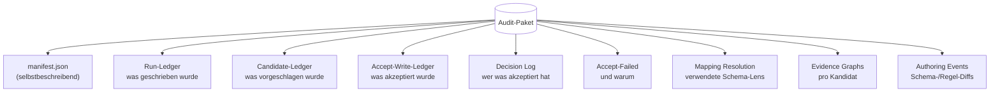

# Audit und Provenienz

Provenienz und Audit beantworten zwei verwandte, aber unterschiedliche Fragen. Provenienz fragt, woher ein bestimmter Fakt stammt, und ist eine Eigenschaft jedes einzelnen Ledger-Eintrags. Audit fragt, was in einem bestimmten Lauf des Systems passiert ist und ob ein Dritter diesen Lauf nachvollziehen oder prüfen kann. Beides hängt eng zusammen: Eine Audit-Story aus Fakten ohne erhaltene Provenienz ist kaum eine Audit-Story. Der Kernel behandelt beide Aspekte aber über unterschiedliche Mechanismen. Diese Seite beschreibt die Metadaten, die mit jedem Fakt mitlaufen, die Records zu jedem Lauf, die Evidenzformen von Ableitungen und das Format des Audit-Pakets, das all diese Daten zu einem eigenständigen Artefakt für Archivierung und Offline-Prüfung bündelt.

## Provenienz an jedem Fakt

Jeder Eintrag im Ledger trägt Metadaten über den Akt seiner Assertion. Der Kernel ergänzt selbst den Zeitstempel, zu dem die Assertion geschrieben wurde, und die Assertion-ID, über die der Eintrag später referenziert werden kann. Alles Weitere stammt von der schreibenden Seite. Der Kernel erzwingt keine Namenskonventionen, aber einige Schlüssel tauchen in factpy-Codebasen regelmäßig auf: `source` für das System oder den Prozess, der geschrieben hat; `trace_id`, um mehrere Assertions aus derselben logischen Operation zu verbinden; `confidence`, falls der Fakt aus probabilistischen Quellen oder Modelloutputs stammt; und beliebige weitere Schlüssel, die eine Anwendung braucht, etwa Reviewer, Request-ID oder Batch-ID.

Provenienz liegt an der einzelnen Assertion, nicht an der Entität. Wenn der Name einer Person bei t=10 von einem Import-Job gesetzt und bei t=50 von einem Reviewer korrigiert wurde, enthält das Ledger zwei verschiedene Assertions mit zwei verschiedenen Metadatenblöcken. Der Snapshot reduziert sie auf den neuesten nicht zurückgezogenen Wert, während die Audit-Story beide erhält: Quelle, Zeitpunkt und weitere Metadaten der jeweiligen Assertion. Genau das kann ein Store mit mutablen Zeilen nicht leisten. Eine Zeile enthält höchstens die Metadaten des letzten Schreibers, und das Überschreiben des alten Werts überschreibt meist auch die Spuren seiner Herkunft. Das append-only-Ledger ist so gebaut, dass dieser Verlust nicht auftreten kann.

## Records zu jedem Lauf

Provenienz erklärt Fakten; Audit erklärt Operationen. Zusätzlich zu den Metadaten einzelner Schreibvorgänge hält der Kernel für jeden Lauf genügend strukturierte Informationen fest, um zu rekonstruieren, was getan wurde. Ein Regellauf speichert ID und Version der Regel, den Ledger-Zustand, gegen den sie lief, und die zurückgegebenen Zeilen. Eine Ableitungsauswertung speichert die Ableitung, ihren Body oder ihre Bodys, die erzeugten Kandidaten und die stützenden Ledger-Einträge jedes Kandidaten. Eine Annahme speichert den akzeptierten Kandidaten, den Reviewer oder Prozess, der ihn akzeptiert hat, die daraus entstandenen neuen Ledger-Einträge und die Evidenz, die als Provenienz an diesen Einträgen erhalten bleibt. Eine Änderung an Schema, Regel oder Ableitung speichert ein Apply-Event zusammen mit dem Diff, der sie erzeugt hat. Diese Records sind strukturiert genug, um replayfähig zu sein: Dasselbe Ledger und dieselbe Regel erzeugen denselben Output. Wenn ein Schritt von etwas abhängt, das der Kernel nicht selbst reproduzieren kann — etwa einem nichtdeterministischen Adapter oder einem externen Service während der Auswertung —, wird diese Abhängigkeit als Teil des Laufs aufgezeichnet, statt implizit zu bleiben.

## Evidenz: Bäume und Graphen

Wenn eine Ableitung einen Kandidaten erzeugt, hängt der Kernel einen Evidenz-Record daran. Dieser nennt die Regel und ihre Version und identifiziert jeden Ledger-Eintrag, der den Match gestützt hat. Beim nativen Evaluator hat dieser Record die Form eines Baums. Der Kandidat ist die Wurzel, die Body-Matches sind seine Kinder, Subregel-Referenzen über `RuleRef` erzeugen weitere Kinder, und die Blätter sind die konkreten Ledger-Einträge, die die Atome des Bodys erfüllt haben.

```
candidate:  Person.tag(alice, "vip")
└── derivation: drv.vip_inference v1.0.0
    └── body 1 (confidence=0.95)
        ├── Person(alice)             ← entry #140
        ├── Person.locale(alice,"en") ← entry #141
        └── profile:vip(alice, true)  ← entry #142
```

Bei Engines, deren Reasoning nicht baumförmig ist — etwa PyReason mit Propagation durch einen Graphen über diskrete Zeitschritte oder ProbLog mit Proof-Strukturen für bestimmte Queries — ist auch der Evidenz-Record ein Graph. Ein Baum kann nicht sauber ausdrücken, dass mehrere Pfade dieselbe Schlussfolgerung stützen, oder dass eine probabilistische Inferenz als gerichteter azyklischer Graph statt als Hierarchie aufgebaut ist. Der Kernel stellt diese Form als `EvidenceGraph` bereit, mit typisierten Knoten wie `seed`, `premise` und `conclusion`, typisierten Kanten wie `supports`, `derives` und `updates` sowie einem Layout-Hinweis, damit Renderer zwischen Baum- und Timeline-Ansichten wählen können. Die Graphform ist engine-agnostisch; ihr Inhalt ist engine-spezifisch. Ein nativer Trace, eine PyReason-Propagation und eine ProbLog-Inferenz erklären ihre Schlüsse unterschiedlich, auch wenn sie am Ende denselben Fakt erzeugen.

## Das Audit-Paket

Ein Audit-Paket ist ein eigenständiges Verzeichnis, das einen Lauf oder eine Menge von Läufen zu einem Artefakt für Archivierung, Transfer oder Offline-Prüfung bündelt. In diesem Format macht ein factpy-System seine Audit-Story portabel. Erzeugt wird es mit einem einzigen Aufruf von `sdk.export_package`.



Das Paket trennt vier Themen in eigene Dateien. Die Fakten liegen im Run-Ledger. Die während des Laufs von Ableitungen erzeugten Kandidaten liegen zusammen mit ihrer Evidenz im Candidate-Ledger und in den kandidatenspezifischen Evidence-Records. Die Entscheidungen über diese Kandidaten — welche akzeptiert wurden, von wem, welche abgelehnt wurden und warum — liegen im Decision Log und im Accept-Write-Ledger. Die während des Laufs verwendeten Schema- und Regelversionen sowie etwaige Authoring-Änderungen werden als begleitende Maschinerie ebenfalls aufgezeichnet. Ein Manifest auf oberster Ebene erklärt den Pakettyp und listet die relativen Pfade aller Bestandteile. Ein Reader muss daher das interne Layout nicht kennen, um sich im Paket zurechtzufinden. Das Manifest ist der maßgebliche Index und sollte beim Lesen eines Audit-Pakets zuerst geöffnet werden.

Ein Paket ist in dem Maß reproduzierbar, in dem seine Inputs reproduzierbar sind. Schema- und Regelversionen werden exakt erfasst. Run-Ledger und Candidate-Ledger sind deterministische Ergebnisse der Schreibvorgänge und Regeln. Evidence Graphs sind deterministische Ergebnisse der Engine, die sie erzeugt hat. Wenn eine Adapter-Engine nichtdeterministische Bestandteile zulässt — etwa einen Wall-Clock-Timeout oder einen stochastischen Solver —, wird die relevante Konfiguration zusammen mit dem Ergebnis gespeichert. So bleiben die Bedingungen des Laufs rekonstruierbar, auch wenn der Output nicht Bit für Bit reproduzierbar ist.

## Audit-Pakete offline lesen

Das Modul `kernel.audit` liest Audit-Pakete, ohne vom Rest des Kernels abhängig zu sein.

```python
from kernel.audit import load_audit_package

pkg = load_audit_package("./audits/run-2024-04-01")
print(pkg.manifest["package_kind"])    # "audit"
print(len(pkg.candidate_ledger))       # candidates produced
print(len(pkg.accept_write_ledger))    # candidates accepted
```

`load_audit_package` gibt die Inhalte des Pakets als einfache Daten zurück: das Manifest als geparstes JSON-Objekt, die verschiedenen Ledgers als Listen jsonl-decodierter Einträge, die Evidence Graphs als `EvidenceGraph`-Instanzen und das Decision Log als Liste von Decision-Einträgen. Daraus können Anwendungen und Reviewer die Ansichten bauen, die sie brauchen: eine Compliance-Zusammenfassung mit Entscheidungen pro Reviewer, einen Trace pro Regel mit den gelaufenen Versionen, den vollständigen Evidenzbaum eines einzelnen Kandidaten oder eine Timeline, die rekonstruiert, wie ein bestimmter Fakt wahr wurde. Der Kernel liefert Builder-Funktionen für die häufigsten dieser Ansichten mit, darunter `build_decision_detail_dto`, `build_rule_trace_detail_dto` und `build_candidate_evidence_tree_dto`. Sie dienen sowohl als fertige Navigation für Anwendungen, die keine eigenen Views schreiben wollen, als auch als Beispiele dafür, welche Informationen die einzelnen Teile des Pakets enthalten.

## Warum Audit und Provenienz zum Kernel gehören

Audit-Funktionen, die erst nachträglich an ein System angebaut werden, bleiben typischerweise lückenhaft. Sie zeichnen auf, was an den vorhandenen Integrationspunkten beobachtbar war — hier ein Datenbank-Trigger, dort ein Request-Log, dazu gelegentliche Snapshots von Zustand. Das Ergebnis ist eher eine Rekonstruktion als ein Record: mit Lücken dort, wo eine Operation zwischen den Beobachtungspunkten lag, und ohne Garantie, dass die beobachteten Teile eine kohärente Geschichte ergeben.

factpy setzt die Integrationspunkte dort, wo sie gebraucht werden, indem es sie zum Teil des Kerns macht. Jeder Fakt ist eine Assertion mit Provenienz, jeder Regellauf ist eine Operation mit Record, jede Ableitung erzeugt einen Kandidaten mit Evidenz, jede Annahme erzeugt einen Eintrag im Decision Log. Das Audit-Paket ist nicht mehr als diese Records, gesammelt in einem Verzeichnis. Nichts darin wird nachträglich rekonstruiert, weil beim Erstellen der Records nichts verworfen wurde. Der Preis dieses Designs — zusätzliche Metadaten an jeder Operation und zusätzliche Struktur an jedem Kandidaten — erkauft eine Audit-Story, die kein separater Bericht ist, sondern dieselbe Datenstruktur, die während des Laufs verwendet und anschließend in ein Verzeichnis geschrieben wird.

## Nächste Schritte

Der [Guide zum Auditieren eines Laufs](/docs/guides/auditing-a-run) zeigt, wie ein Audit-Paket aus einem realen Workflow erzeugt und wieder gelesen wird. Die Referenz zu `kernel.audit` beschreibt Paketlayout, Builder-DTOs sowie die Node- und Edge-Taxonomie der Evidence Graphs vollständig. Wie Provenienz überhaupt ins Ledger gelangt, steht unter [Das Ledger](/docs/concepts/the-ledger) und [Regeln und Ableitungen](/docs/concepts/rules-and-derivations).
