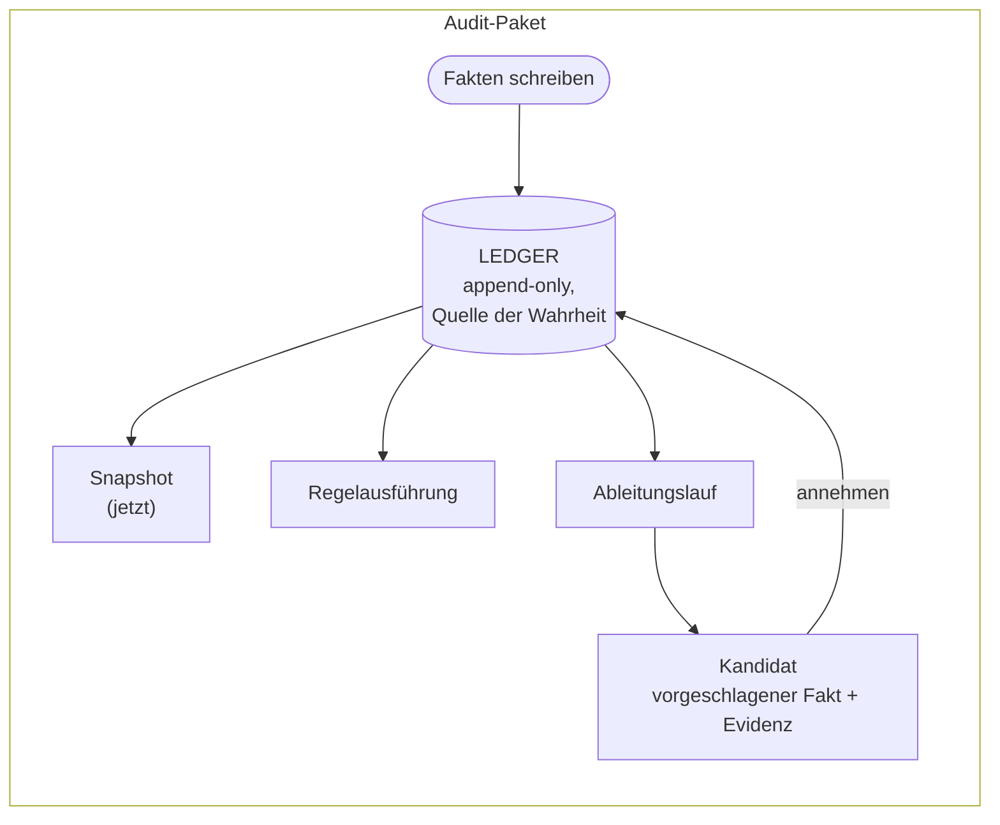

# Überblick

Die Architektur von factpy beruht auf einer zentralen Entscheidung: Zustand wird nicht direkt gespeichert, sondern aus Fakten berechnet. Jede Aussage über eine Entität wird als eigener Fakt festgehalten. Der aktuelle Zustand einer Entität entsteht erst dann, wenn er gebraucht wird, indem diese Fakten nach den Regeln des Schemas zu einem Snapshot verdichtet werden. Es gibt keine Zeile, die aktualisiert wird, und kein Dokument, das ersetzt wird. Eine Entität ist die Projektion all dessen, was jemals über sie ausgesagt wurde. Die übrigen Komponenten des Kernels — Schema, Regeln, Ableitungen und Audit-Pakete — dienen dazu, diese Arbeitsweise praktikabel zu machen und die dabei entstehende Evidenzspur zu erhalten. Diese Seite beschreibt die Architektur auf einer gemeinsamen Abstraktionsebene; die vier folgenden Konzeptseiten behandeln die einzelnen Bestandteile im Detail.

## Fakten

Ein Fakt in factpy ist die kleinste mögliche Aussage über die Welt: ein Prädikat, ein Subjekt, ein Wert und die Metadaten des Schreibvorgangs. Die Aussage, dass eine bestimmte Person *Alice* heißt und an einem bestimmten Tag von einem Import-Job geschrieben wurde, ist ein Fakt. Wenn später ein anderer Prozess festhält, dass dieselbe Person nun *Alicia* heißt, entsteht ein zweiter Fakt. Der erste wird nicht verändert. Beide bleiben im System erhalten und lassen sich über Zeitstempel und Herkunftsmetadaten voneinander unterscheiden.

Diese Art, Zustand zu modellieren, ist nicht neu. Event-Logs, Buchhaltungsjournale und Versionskontrollsysteme folgen einem ähnlichen Grundmuster. factpy macht diese Form jedoch zur Grundlage des gesamten Designs. Wenn zwei Quellen sich bei demselben Prädikat widersprechen, entstehen zwei Fakten, und der Widerspruch bleibt sichtbar, statt durch Überschreiben zu verschwinden. Wie eine Entität zu ihrem aktuellen Zustand gekommen ist, bleibt ohne zusätzliche Instrumentierung nachvollziehbar. Die Herkunft einer Aussage steckt in der Aussage selbst und muss nicht nachträglich aus einer mehrfach veränderten Zeile rekonstruiert werden. Der Snapshot einer Entität wird erzeugt, indem die relevanten Fakten nach der Kardinalität des jeweiligen Feldes reduziert werden: einwertige Felder nehmen die neueste aktive Aussage, mehrwertige Felder die Vereinigung ihrer aktiven Aussagen, und zurückgezogene Einträge werden übersprungen. Die Historie geht dabei nicht verloren; sie erscheint nur nicht in der Snapshot-Ansicht.

## Das Ledger

Die Struktur, in der die Fakten liegen, heißt Ledger. Sie ist strikt append-only: Jeder Schreibvorgang erzeugt einen neuen Eintrag und verändert oder löscht niemals einen alten. Das SDK stellt Operationen bereit, die aus gewöhnlichen Stores vertraut wirken — `set`, `add`, `retract` —, doch intern werden sie alle als Append ins Ledger umgesetzt, nicht als In-place-Änderung eines separat gehaltenen Zustands. Auch eine Retraktion entfernt die betroffene Aussage nicht. Sie ist ein neuer Eintrag, der bei der nächsten Snapshot-Berechnung dafür sorgt, dass die zurückgezogene Aussage in der Projektion übersprungen wird. Das Ledger enthält damit sowohl die ursprüngliche Behauptung als auch den Akt ihrer Zurücknahme. Ein Audit-Reader sieht beides in der richtigen Reihenfolge.

Das Ledger ist die einzige Quelle der Wahrheit in einem factpy-System. Der Snapshot einer Entität, die Zeilen einer Query und die von einer Ableitung vorgeschlagenen Kandidaten sind alles Projektionen des Ledgers. Keines dieser Ergebnisse hält eigenen Zustand. Jedes lässt sich reproduzieren, indem das Ledger bis zum relevanten Punkt erneut ausgewertet wird.

## Schema

Ein Schema in factpy ist eher ein Vokabular als ein Layout. Klassen, die von `Entity` erben, deklarieren, über welche Arten von Dingen das System Fakten halten kann. Die darin definierten `Identity`- und `Field`-Deklarationen legen fest, über welche Koordinaten eine Entität identifiziert wird und welche Prädikate für Aussagen verfügbar sind. Es gibt keine Tabelle, kein Zeilenlayout und keine feste Spaltenordnung. Es gibt nur typisierte Prädikate und die Kardinalität, mit der ihre Fakten in der Projektion zusammengeführt werden.

Dadurch ist die Rolle des Schemas enger gefasst. Es beschreibt nicht, wie Fakten gespeichert werden, denn alle Fakten werden gleich gespeichert. Es beschreibt, welche Fakten lesbar sind: welche Prädikate die Projektion reduzieren kann, welche Wertbereiche Aussagen haben dürfen und über welche Beziehungen Regeln Joins bilden können. Eine Schemaänderung, die diese Lesbarkeit erhält, etwa das Hinzufügen eines neuen Feldes oder einer neuen Entität, braucht keine Migration und keinen neuen Digest. Eine Änderung, die die Lesbarkeit bricht, etwa das Umbenennen eines Feldes oder das Ändern einer Kardinalität, wird beim Öffnen über einen Content-Hash des Schemas erkannt und abgelehnt, bis die Migration bewusst durchgeführt wurde.

## Regeln

Eine Regel formuliert eine Frage an das Ledger. Ihr Body enthält die Bedingungen, die für eine bestimmte Bindung von Logikvariablen gleichzeitig erfüllt sein müssen. Ihr Head beschreibt, was für jede passende Bindung zurückgegeben werden soll. Bedingungen können eine einzelne Entität einschränken, Entitäten über gemeinsame Variablen oder Referenzfelder verbinden, fehlschlagen, wenn eine entsprechende Aussage im Ledger nicht vorhanden ist — mit Negation-as-Failure-Semantik, nicht mit expliziter Negation — und andere benannte Regeln aufrufen, um größere Queries aus kleineren zusammenzusetzen.

Eine Regel ist zugleich eine ausführbare Query und eine benannte Definition, auf die andere Regeln per Identifier verweisen können. Jede Regel hat eine Version. Wird sie ausgeführt, hält der Audit-Trail fest, welche Version gegen welchen Ledger-Zustand ausgewertet wurde und welche Zeilen dabei entstanden sind. Zwei Versionen derselben Regel können aus demselben Ledger unterschiedliche Antworten erzeugen, weil der Body bewusst geändert wurde. Die Audit-Spur hält diese Läufe auseinander, damit ein Ergebnis von gestern unter einer alten Regelversion nicht stillschweigend mit einem Ergebnis von heute unter einer neuen Version verwechselt wird.

## Ableitungen

Eine Ableitung ist eine Regel, deren Head keine Daten zurückgibt, sondern neue Fakten vorschlägt. Jede Bindung, die den Body erfüllt, erzeugt einen *Kandidaten*: einen Fakt in der vom Head beschriebenen Form, ergänzt um Identität und Version der Regel sowie die Ledger-Einträge, die den Match gestützt haben. Ein Kandidat ist noch kein Fakt im Ledger. Er ist ein Vorschlag, über den entschieden werden muss.

Die Annahme eines Kandidaten ist ein eigener Schritt. Ein Aufruf von `sdk.accept` oder im Batch von `sdk.accept_many` schreibt den Kandidaten als gewöhnliche Aussage ins Ledger und übernimmt seine Evidenz als Provenienz des neuen Eintrags. Jede Annahme wird zusammen mit den daraus entstehenden Schreibvorgängen in einem Decision Log festgehalten. So gelangt kein Fakt ins Ledger, ohne dass ein bestimmbarer Akt der Entscheidung dahintersteht. Damit ist jeder Fakt im Ledger entweder direkt geschrieben oder bewusst aus einem Kandidaten akzeptiert worden. Jeder abgeleitete Fakt bleibt sowohl auf seine stützenden Fakten als auch auf die Regel und den Annahmezeitpunkt zurückführbar. Genau diese Trennung — Auswertung erzeugt Kandidaten, ein separater Schritt akzeptiert sie — unterscheidet ein auditierbares Inferenzsystem von einem nicht auditierbaren. Eine Engine, die ihre Schlüsse sofort in gemeinsamen Zustand schreibt, verliert den Moment, in dem ein bestimmter Schluss bestätigt wurde. factpy erhält diesen Moment konstruktiv.

## Audit

Weil die Provenienz lokal an jedem Fakt liegt, weil das Rule Registry jede jemals ausgeführte Regelversion kennt, weil das Candidate Ledger jeden ausgewerteten Vorschlag speichert und weil das Decision Log jede Annahme festhält, braucht es keine zusätzliche Buchführung, um zu rekonstruieren, was ein System getan hat. Ein vollständiges *Audit-Paket* ist die Vereinigung dieser Aufzeichnungen, serialisiert als eigenständiges Verzeichnis und erzeugt durch einen einzigen Aufruf von `sdk.export_package`. Das Paket kann archiviert, in einem separaten Prozess geprüft oder über das kleine Modul `kernel.audit` wieder eingelesen werden, ohne den Rest des Kernels zu benötigen. Es ist kein nachträglich für Compliance-Zwecke zusammengebautes Nebenprodukt. Es sind dieselben Daten, mit denen das System zur Laufzeit über sich selbst Auskunft gibt, nur in portabler Form. Ein solches Paket zu erzeugen ist mechanisch, weil während der Ausführung nichts verworfen wurde.

## Zusammenspiel der Teile

Ein factpy-Programm beliebiger Größe kombiniert diese Elemente in unterschiedlichen Anteilen. Der meiste Anwendungscode schreibt Fakten und liest Snapshots. Ein Teil führt Regeln und Queries aus. Die Teile, die Schlüsse ziehen, werten Ableitungen aus und akzeptieren ausgewählte Kandidaten. Review und nachträgliche Analyse lesen die Audit-Pakete, die aus solchen Läufen exportiert wurden. Jeder dieser Schritte trägt zum selben Datensatz bei, und genau dieser Datensatz macht das System überprüfbar.

## Nächste Schritte

[Entities and fields](/docs/concepts/entities-and-fields) beschreibt die Schemaebene. [The ledger](/docs/concepts/the-ledger) behandelt das append-only-Modell und die Mechanik der Projektion im Detail. [Rules and derivations](/docs/concepts/rules-and-derivations) erklärt die Reasoning-Schicht von Anfang bis Ende. [Audit and provenance](/docs/concepts/audit-and-provenance) beschreibt, was während eines Laufs aufgezeichnet wird, was ein exportiertes Paket enthält und wie es wieder gelesen wird. Der [quickstart](/docs/quickstart) zeigt dieselbe Architektur in ausführbarem Code für Leser, die sie lieber zuerst in Aktion sehen.

