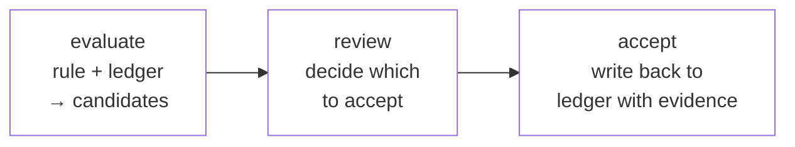

# Regeln und Ableitungen

Die Reasoning-Schicht von factpy ist eine kleine logische Sprache direkt über dem Ledger. Eine Regel beschreibt, unter welchen Bedingungen ein Body aus Clauses für eine bestimmte Variablenbindung gleichzeitig erfüllt ist, und gibt diese Bindungen als Zeilen zurück. Eine Ableitung ist eine Regel, deren Head keine Zeilen projiziert, sondern neue Fakten benennt, die vorgeschlagen werden, wenn der Body passt. Beide werden vom Kernel gegen das Ledger ausgewertet, beide tragen stabile Identifier und explizite Versionen, und beide hinterlassen eine Auswertungsspur, die Teil der Audit-Story ist. Diese Seite beschreibt den Aufbau einer Regel, die Sprache ihres Bodys, das Verhältnis zwischen einer Regel als Query und einer Regel als Ableitung sowie den Lebenszyklus aus Kandidat und Annahme, der ein auditierbares Inferenzsystem von einem nicht auditierbaren unterscheidet.

## Aufbau einer Regel

Eine Regel wird in Python als `Rule`-Objekt konstruiert. Ihre zwei strukturell wichtigen Teile sind ein `select`-Head und ein `where`-Body.

```python
with vars("p", "n") as (p, n):
    vip_in_good_standing = Rule(
        id="q.vip_ok",
        version="1.0.0",
        select=[n],
        where=[
            Person(p),
            Pred("person:tag", p, "vip"),
            Not([Pred("person:tag", p, "blocked")]),
            p.name == n,
        ],
    )
```

Der `select`-Head legt fest, was für jede Variablenbindung zurückgegeben wird, die den Body erfüllt, hier also die Variable `n`. Der `where`-Body ist eine Liste von Clauses, die gleichzeitig gelten müssen. Sie werden in einem kleinen festen Vokabular von Atomen formuliert.

In der Praxis kommen vier Atomformen vor. `Pred(predicate, subject, value)` verlangt, dass das Ledger eine aktive Aussage mit dem genannten Prädikat, Subjekt und Wert enthält. Im Beispiel oben verlangt `Pred("person:tag", p, "vip")`, dass `p` den Tag `vip` trägt. `Not(...)` negiert eine Liste von Clauses unter Negation-as-Failure-Semantik; das wird weiter unten gesondert behandelt. `EntityClass(var)`, etwa `Person(p)`, erklärt, dass die Variable über Instanzen dieser Entitätsklasse läuft, und dient zugleich als Typdeklaration und als Join-Clause, wenn andere Atome auf Felder dieser Variable verweisen. Feldgleichheiten direkt auf entitätstypisierten Variablen — `p.name == n`, `p.locale == "en"` — binden den Wert eines Feldes an eine Variable oder beschränken ihn auf ein Literal. Sie sind typisierte Kurzformen für das entsprechende `Pred`-Atom und werden bevorzugt, wenn der konkrete Prädikatname an der Aufrufstelle nicht interessant ist.

Variablen werden mit dem Context Manager `vars(...)` erzeugt, der pro übergebenem Namen eine Logikvariable liefert. Die Namen dienen als Anzeigenamen in Row-Dicts und Audit-Traces. Derselbe String in zwei verschiedenen `vars(...)`-Blöcken erzeugt zwei verschiedene Variablen. `id` und `version` der Regel sind nicht dekorativ. Unter diesen Identifikatoren registriert der Kernel die Regel, verweist in Audit-Records und Evidence-Trees auf sie und löst Referenzen von einer Regel auf eine andere auf. Eine Änderung am Body, die gegen dasselbe Ledger andere Bindungen erzeugen würde, rechtfertigt eine neue Version, weil der Audit-Trail die Version braucht, um Läufe der einen Regel von Läufen der anderen zu unterscheiden.

## Regeln als Queries

Die einfachste Verwendung einer Regel ist, sie für ihre Zeilen auszuführen.

```python
sdk.run(vip_in_good_standing, row_format="dict")
# [{'n': 'Alice'}]
```

`sdk.run` gibt eine Liste von Zeilen zurück. Jede Zeile enthält eine Belegung der Variablen, die im Head genannt sind. Das Standardformat ist `"dict"` mit den Variablennamen als Keys. Alternativen sind `"tuple"`, das die Namen weglässt und positionale Zeilen für nachgelagerte Verbraucher liefert, und `"instance"`, das sinnvoll ist, wenn der Head aus genau einer entitätstypisierten Variable besteht und die passenden Entitäten als Snapshots in derselben Form zurückgibt wie `sdk.get`. Ein Default kann beim Öffnen des Stores über `default_row_format=` konfiguriert werden; `row_format=` am einzelnen Aufruf überschreibt ihn.

Ein Regellauf ist eine Projektion des Ledgers im Sinn von [das Ledger](the-ledger.md). Dasselbe Ledger und dieselbe Regel erzeugen dieselben Zeilen. Die Regel schreibt während der Auswertung nichts ins Ledger zurück. Eine Query, die keine Zeilen zurückgibt, bedeutet nicht, dass sich etwas geändert hat, sondern beschreibt den Zustand des Ledgers, gegen den sie gelaufen ist.

## Regeln als Definitionen

Eine Regel ist außerdem ein benanntes, wiederverwendbares Konstrukt. Sobald eine Regel deklariert ist, kann eine andere Regel sie über `RuleRef` in ihrem eigenen Body referenzieren. Dabei wird der Body der referenzierten Regel in den Body der aufrufenden Regel eingebunden, mit den Variablen an die Aufrufstelle gebunden.

```python
with vars("p") as (p,):
    high_priority = Rule(
        id="q.high_priority",
        version="1.0.0",
        select=[p],
        where=[
            RuleRef(vip_in_good_standing)(p),
            Pred("person:tag", p, "active"),
        ],
    )
```

`RuleRef(vip_in_good_standing)(p)` macht die Bedingung *vip in good standing* zu einer Sub-Clause des Bodys von *high priority*, wobei `p` als gefundene Person durchgereicht wird. Die inhaltliche Folge ist, dass es genau eine Definition von *vip in good standing* gibt und jede Änderung daran auf alle Regeln wirkt, die sie referenzieren. Eine kopierte Alternative hätte weder diese Weitergabe noch den Audit-Vorteil, dass der Evidence-Record der abhängigen Regel die referenzierte Regel mit ID und Version benennt. Ein Audit-Reader kann dadurch einen *high priority*-Match bis zu der *vip in good standing*-Bedingung zurückverfolgen, die ihn legitimiert hat. Die modulübergreifende Form `RuleRef("q.vip_ok", version="1.0.0")` ist verfügbar, wenn das Regelobjekt selbst nicht im Scope liegt, und ist die idiomatische Form für Referenzen zwischen getrennten Modulen.

Diese Komposition erlaubt es, über den Prädikaten des Schemas ein Vokabular benannter Konzepte aufzubauen. Jedes Konzept ist über Name und Version adressierbar, statt überall neu ausformuliert zu werden.

## Negation as Failure

Das Atom `Not(...)` negiert eine Liste von Clauses, und die natürliche Lesart von *not blocked* ist die, die Anwendungscode meistens meint. Die Semantik ist aber präzise und wichtig, weil sie keine explizite Negation ist. Eine `Not`-Clause ist erfolgreich, wenn das Ledger ihren Body aktuell nicht stützt, und schlägt fehl, wenn es ihn stützt. Es gibt im Ledger keine positive Aussage *not blocked*. Die Regel prüft die Abwesenheit einer Aussage, dass das Subjekt blockiert ist, nicht die Anwesenheit einer Aussage, dass es nicht blockiert ist.

Der Unterschied ist in zwei Situationen wichtig. Wenn Daten nach und nach aus mehreren Quellen eintreffen, kann eine Regel, die vor einem Import noch *Alice ist nicht blockiert* ergeben hat, danach das Gegenteil ergeben, ohne dass die Regel selbst geändert wurde. Die Aussage war korrekt gegen das Ledger, gegen das sie lief, aber das Ledger hat sich geändert. Wenn eine Regel ausdrücken soll, dass eine positive Aussage über *nicht etwas* aufgezeichnet wurde, ist der Negationsoperator das falsche Werkzeug. Dann gehört der Zustand als explizites Feld ins Modell, etwa `Person.status == "active"`, das ein Upstream-Akteur affirmativ setzt und das die Regel positiv abfragt, statt das Komplement zu negieren.

Da jeder Regellauf zusammen mit einem Verweis auf den Ledger-Zustand aufgezeichnet wird, gegen den er lief, bewahrt der Audit-Trail, welche Antwort eine Regel zu einem bestimmten Zeitpunkt und gegen eine bestimmte Menge von Aussagen gegeben hat. Ein gekipptes Ergebnis erscheint daher als gekipptes Ergebnis, zusammen mit der Änderung der Inputs, die es verursacht hat, und nicht als Inkonsistenz zwischen zwei Läufen.

## Ableitungen

Eine Ableitung verwendet dieselbe Body-Sprache wie eine Regel und trägt ebenfalls ID und Version. Der strukturelle Unterschied liegt im Head: Eine `Rule` projiziert Variablenbindungen als Zeilen, eine `Derivation` deklariert dagegen einen faktförmigen Head, der beschreibt, was für jede passende Bindung vorgeschlagen werden soll.

```python
with vars("p", "loc", "nm") as (p, loc, nm):
    auto_alias = Derivation(
        id="drv.auto_alias",
        version="1.0.0",
        where=[Person(p), p.locale == loc, p.name == nm],
        head=Person.tag(locale=loc, tag=nm),
    )
```

Der Head `Person.tag(locale=loc, tag=nm)` ist ein Feldaufruf. Identity-Koordinaten und Feldwert werden aus den Bindungen des Bodys gelesen, und pro erfüllter Body-Bindung wird ein solcher Head-Fakt vorgeschlagen. Eine Ableitung kann auch eine Liste von Head-Feldaufrufen deklarieren, wenn ein Body-Match mehrere zusammengehörige Fakten erzeugen soll.

`sdk.evaluate(derivation, mode="native")` führt eine Ableitung gegen das aktuelle Ledger aus. Das Ergebnis ist keine Liste von Zeilen, sondern eine Liste von *Kandidaten*: vorgeschlagene Fakten in der Form des Heads, jeweils zusammen mit der Evidenz, die sie hervorgebracht hat. Solange sie nicht akzeptiert sind, gehören Kandidaten nicht zum Ledger. Sie sind das Angebot des Kernels, was nach dieser Regel aus dem aktuellen Zustand folgen würde, ohne dass damit schon entschieden wäre, ob dieses Angebot angenommen werden soll.

Der inhaltliche Unterschied zwischen einem direkt geschriebenen Fakt und einem Fakt aus einer Ableitung liegt nicht im Fakt selbst, sondern darin, welche Art von Aussage ihn ins Ledger bringt. Ein direkter Schreibvorgang behauptet ein Ergebnis. Eine Ableitung behauptet eine Regel und die Beobachtung, dass diese Regel gegen das aktuelle Ledger den vorgeschlagenen Fakt lizenziert. Im Snapshot können beide denselben Wert ergeben. Ein direkter Schreibvorgang lässt sich aber nur durch Vertrauen in den Schreiber bestätigen, während eine akzeptierte Ableitung gegen das Ledger ihres Zeitpunkts erneut ausgewertet und unabhängig geprüft werden kann. Ein System, das abgeleitete Schlüsse direkt schreiben würde, verwürfe die Form des Arguments und behielte nur das Ergebnis. Die Trennung zwischen Regel, Kandidat und Annahme bewahrt das Argument als Teil dessen, was das System aufzeichnet.

## Kandidaten und Evidenz

Ein Kandidat ist nicht nur der Head-Fakt, den eine Ableitung schreiben würde. Er ist dieser Head-Fakt zusammen mit einer strukturierten Darstellung seiner Herkunft: Identität und Version der Regel, die Bindung der Body-Variablen, die den Match erfüllt hat, und die Ledger-Einträge, die die einzelnen Clauses des Bodys gestützt haben. Für das obige Beispiel sieht die konzeptionelle Form eines Kandidaten so aus:

```
candidate:    Person.tag(person_id="alice", locale="en", tag="Alice")
produced by:  drv.auto_alias v1.0.0
supported by:
  - Person(alice)               ← entry #140, source=import_job, t=10
  - Person.locale(alice, "en")  ← entry #141, source=import_job, t=10
  - Person.name(alice, "Alice") ← entry #142, source=import_job, t=10
```

Die Supports sind selbst Ledger-Einträge mit eigener Provenienz. Wenn ein Kandidat akzeptiert und Teil des Ledgers wird, bleibt die Evidenzkette dadurch intakt: Ein Audit-Reader kann für jeden abgeleiteten Fakt fragen, welche Regel ihn erzeugt hat, gegen welche Bindung, auf Basis welcher Einträge, die wiederum jeweils die Metadaten ihrer Herkunft tragen. Wenn Ableitungen verkettet werden — also ein akzeptierter abgeleiteter Fakt im Body einer weiteren Ableitung verwendet wird —, wird die Evidenz weitergetragen. Die Kette zurück zu den ursprünglichen Aussagen bleibt nachvollziehbar, egal wie viele Schritte sie umfasst.

## Auswerten, prüfen, akzeptieren

Der Lebenszyklus einer Ableitung besteht aus drei Schritten. Die Auswertung führt die Ableitung gegen das Ledger aus und erzeugt Kandidaten, ohne etwas zu schreiben. Sie ist read-only und side-effect-free; dieselbe Auswertung gegen dasselbe Ledger liefert dieselben Kandidaten. Die Prüfung ist der Schritt, in dem entschieden wird, welche Kandidaten akzeptiert werden sollen. Diese Entscheidung kann programmatisch sein, etwa ein Filter auf Confidence-Werte oder eine Policy, die alle Kandidaten einer vertrauenswürdigen Ableitung akzeptiert. Sie kann einen menschlichen Reviewer in einer Oberfläche einbeziehen. Oder sie kann durch eine Policy trivial werden, die alle Kandidaten grundsätzlich akzeptiert. Die Annahme schreibt die akzeptierten Kandidaten als neue Aussagen ins Ledger und bewahrt ihre Evidenz als Provenienz der neuen Einträge. Sie ist eine eigene Operation, getrennt von der Auswertung, und genau diese Trennung ist der architektonische Punkt.



Architektonisch bedeutet das: Jeder Fakt im Ledger wurde entweder direkt geschrieben oder durch eine bewusste Entscheidung aus einem Kandidaten akzeptiert. Diese Entscheidung wird zusammen mit den daraus entstandenen Schreibvorgängen in einem Decision Log aufgezeichnet. Es gibt keine dritte Kategorie von Fakten, die ins Ledger gelangt sind, weil irgendeine Engine entschieden hat, dass sie dort sein sollten. Wenn ein Fakt im Ledger liegt, hat ihn ein identifizierbarer Schreib- oder Annahmeakt dorthin gebracht, mit Metadaten zu Wer und Wann. Diese Eigenschaft unterscheidet ein Reasoning-System, dessen Schlüsse überprüft werden können, von einem, dessen Schlüsse nur reproduziert werden können. Der Kernel stellt `sdk.accept` für einzelne Kandidaten und `sdk.accept_many` für Batches bereit. Beide unterstützen einen `dry_run`-Modus, der die Schreibvorgänge anzeigt, ohne sie zu committen. Bei mehreren Accepts in einem Batch kann die Operation atomar konfiguriert werden — alles oder nichts — oder als Best-Effort, bei dem geschrieben wird, was geschrieben werden kann, wenn einzelne Accepts fehlschlagen.

## Confidence und mehrere Bodys

Eine Ableitung kann mehrere Wege zur selben Schlussfolgerung haben, mit unterschiedlichem Vertrauen in jeden Weg. Eine Entität könnte etwa durch ein explizites Profil-Flag mit hoher Confidence klassifiziert werden oder durch Verhaltenssignale aus einem Modell mit niedrigerer Confidence, wobei beide zur selben Head-Aussage führen. Die DSL drückt das über eine Multi-Body-Ableitung aus, in der jeder Body in `Body(...)` gewrappt und mit seiner Confidence versehen wird.

```python
with vars("p", "loc", "tg") as (p, loc, tg):
    vip_inference = Derivation(
        id="drv.vip",
        version="1.0.0",
        where=[
            Body([Person(p), p.locale == loc, Pred("profile:vip", p, True)],
                 confidence=0.95),
            Body([Person(p), p.locale == loc, Pred("model:high_value", p, tg)],
                 confidence=0.6),
        ],
        head=Person.tag(locale=loc, tag="vip"),
    )
```

Jeder Body ist ein alternativer Match-Pfad. Die Bodys werden per Oder verbunden: Ein Kandidat entsteht für jede Bindung, die einen der Bodys erfüllt. Kandidaten tragen die Confidence des Bodys, der sie erzeugt hat. Ein Review-Schritt kann darauf verzweigen, zum Beispiel Kandidaten mit hoher Confidence automatisch akzeptieren und Kandidaten mit niedriger Confidence an einen menschlichen Reviewer leiten. Für den nativen Evaluator ist der Confidence-Wert opak: Er reist als Zahl mit dem Kandidaten mit, geht aber nicht als Wahrscheinlichkeit in die Auswertung ein.

Für Reasoning, das Confidence tatsächlich als Wahrscheinlichkeit behandelt und unter gemeinsamen Verteilungen und Marginalisierung korrekt kombiniert, delegiert factpy über die optionale Adapter-Schicht an ProbLog. Dasselbe `Derivation`-Objekt kann unter beiden Evaluatoren laufen. Was sich ändert, ist die Semantik, unter der Confidence interpretiert wird.

## Adapter-Engines

Der native Evaluator verarbeitet logische Regeln mit Negation, Joins und Regelkomposition über Faktbasen mittlerer Größe und ist für die meisten Ableitungen eines typischen Projekts das richtige Werkzeug. Für drei Reasoning-Formen, die der native Evaluator nicht abdeckt, stellt factpy Engine-Adapter bereit, die dieselben `Rule`- und `Derivation`-Deklarationen unter einem anderen Evaluator ausführen.

PyReason eignet sich für graphförmiges Reasoning, bei dem Beliefs in diskreten Zeitschritten entlang typisierter Beziehungen propagieren. Die Engine arbeitet mit annotierter Logik und Confidence-Intervallen und ist die passende Wahl, wenn das Reasoning selbst Propagation ist und die Daten als typisierter Graph mit Beziehungen vorliegen, die eigene Bounds tragen. ProbLog eignet sich für probabilistische Logikprogrammierung, bei der Inputs Wahrscheinlichkeiten haben und Regeln sie unter gemeinsamen Verteilungen kombinieren. Die Engine gibt marginale Wahrscheinlichkeiten zurück und ist die richtige Wahl, wenn Confidence-Werte als Wahrscheinlichkeiten gemeint sind und die Anwendung ihre korrekte Kombination verlangt. Souffle ist eine kompilierte Datalog-Engine, die große Regelmengen durch Erzeugung nativen Codes auswertet. Sie ist die passende Wahl, wenn die Performance-Grenze des nativen Evaluators bei großen Faktbasen erreicht ist und die Reasoning-Form selbst plain Datalog ist.

Gemeinsam ist den Adaptern, dass die DSL unverändert bleibt, die Audit-Story unverändert bleibt und der Candidate-and-Acceptance-Lebenszyklus dort unverändert bleibt, wo der Adapter Kandidaten erzeugt. Anders ist der Evaluator, der die Regel konsumiert, und die Form der Evidenz, die die Engine produziert. Die Evidenz des nativen Evaluators ist ein Baum. Engines, deren Reasoning sich nicht auf einen Baum reduzieren lässt, erzeugen einen `EvidenceGraph`, dessen reichere Struktur das Audit-Modul über eigene Builder zugänglich macht.

## Nächste Schritte

[Audit und Provenienz](/docs/concepts/audit-and-provenance) entwickelt die Aufzeichnungs- und Exportseite des Regel- und Ableitungslebenszyklus. Der [Guide zum Schreiben von Regeln](/docs/guides/writing-rules) führt durch reale Regelmuster — Joins, Negation, Regelkomposition — für Leser, die dasselbe Material aus praktischer Perspektive lesen möchten. Der [Guide zum Ausführen von Ableitungen](/docs/guides/running-derivations) behandelt die Ergonomie des Evaluate-and-Accept-Zyklus in Produktion. Der [Guide zur Verwendung von Adaptern](/docs/guides/using-adapters) erklärt Auswahl und Konfiguration der drei Adapter-Engines.
