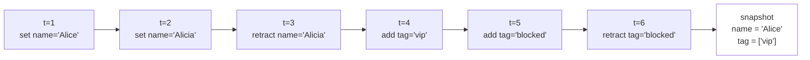

# Das Ledger

Jede Aussage und jede Retraktion, die über das SDK geschrieben wird, landet als neuer Eintrag im Ledger. Einmal geschrieben, wird ein Eintrag nicht mehr verändert oder entfernt. Snapshots, Query-Ergebnisse und die Eingaben für Regelauswertungen sind Projektionen des Ledgers. Sie werden bei Bedarf berechnet und nirgendwo anders als kanonischer Zustand gehalten. Wenn das Schema das Vokabular ist, in dem Aussagen formuliert werden, dann ist das Ledger der Ort, an dem diese Aussagen sich ansammeln. Diese Seite beschreibt, was ein Ledger-Eintrag enthält, wie Leseoperationen die Einträge in die Formen projizieren, die der Rest des Systems verwendet, und warum das Design auf append-only-Schreiben statt auf dem vertrauteren Überschreiben beruht.

## Was ein Eintrag enthält

Jeder Eintrag hält einen einzelnen Schreibakt fest. Der Kernel speichert genug Informationen über diesen Akt, damit er für sich allein verständlich bleibt. Ein Eintrag enthält das betroffene Prädikat, also das Schemafeld in der kleingeschriebenen Form `entity:field`, zusammen mit dem Subjekt, über das geschrieben wird, identifiziert durch Entitätstyp und Identity-Koordinaten. Er enthält den behaupteten Wert oder, im Fall einer Retraktion, den Identifier der früheren Aussage, die zurückgezogen wird. Er enthält die ausgeführte Aktion: `set` für eine einwertige Aussage, `add` für eine mehrwertige Aussage oder `retract` für die explizite Zurücknahme einer früheren Aussage. Außerdem enthält er einen Metadatenblock mit dem vom Kernel vergebenen Zeitstempel, der Assertion-ID, über die der Eintrag später referenziert werden kann, und weiteren vom Schreiber gelieferten Schlüsseln. Üblich sind `source`, `trace_id`, `version`, `valid_from` und `confidence`, doch der Kernel erzwingt diese Konvention nicht. Er verlangt nur, dass die Werte JSON-kompatibel sind. Nach dem Schreiben ist der Eintrag unveränderlich: Ein gestern geschriebenes und heute erneut geöffnetes Ledger ist Byte für Byte dasselbe.

## Was `set`, `add` und `retract` tatsächlich tun

Die drei direkten Schreiboperationen des SDK werden auf dieselbe primitive Ledger-Operation zurückgeführt: das Anhängen eines neuen Eintrags. Sie unterscheiden sich in der Kardinalität des Zielfelds und darin, wie die spätere Projektion sie interpretiert, wenn sie das Ledger zu einem Snapshot reduziert. Ein Aufruf von `sdk.set(Person.name, ref, "Alice")` schreibt eine Aussage auf ein Feld mit einfacher Kardinalität. Ein späterer Aufruf mit `"Alicia"` schreibt einen zweiten, separaten Eintrag, statt den ersten zu überschreiben. Beide Einträge bleiben dauerhaft im Ledger. Ein Aufruf von `sdk.add(Person.tag, ref, "vip")` schreibt eine Aussage auf ein Feld mit mehrfacher Kardinalität. Ein späterer Aufruf mit demselben Wert schreibt ebenfalls einen weiteren Eintrag, unterscheidbar durch Metadaten und Zeitstempel, auch wenn die Projektion beide im Snapshot zu einem einzigen Tag zusammenführt. Ein Aufruf von `sdk.retract` entfernt sein Ziel nicht. Er hängt einen Retraktions-Eintrag an, der über seine ID auf eine frühere Aussage verweist, und spätere Projektionen überspringen diese Aussage bei der Reduktion. Die allgemeine Eigenschaft gilt ohne Ausnahme: Schreibvorgänge ändern keine früheren Einträge. Jede sichtbare Zustandsänderung entsteht durch einen zusätzlichen Eintrag, den die nächste Leseoperation berücksichtigt.

## Snapshots als Projektionen

Ein Snapshot ist die Antwort des Kernels auf die Frage nach dem aktuellen Zustand einer bestimmten Entität. Er ist die häufigste Form, in der das Ledger gelesen wird. Der Snapshot wird nicht als kanonischer Zustand gespeichert. Wenn `sdk.get(Person, person_id="...")` aufgerufen wird, läuft der Kernel über die relevanten Einträge dieser Entität und reduziert sie nach der Kardinalität, die das Schema für jedes Feld deklariert. Einwertige Felder nehmen die neueste nicht zurückgezogene Aussage. Mehrwertige Felder nehmen die Vereinigung aller nicht zurückgezogenen Aussagen; Duplikate fallen in der Projektion zusammen, bleiben im Ledger aber als separate Einträge erhalten. Identity-Felder werden direkt aus der Adresse der Entität gelesen und nicht aus Aussagen, da Identity-Werte gar nicht als Fakten gespeichert werden. Der zurückgegebene Snapshot ist read-only. Der Versuch, einem seiner Attribute einen neuen Wert zuzuweisen, wirft einen Fehler, statt stillschweigend einen Projektionszustand zu mutieren, der keine kanonische Existenz hat.

Die folgende Pseudo-Timeline zeigt sechs Schreibvorgänge auf eine Entität und den Snapshot, den der Kernel daraus erzeugt.



Die zurückgezogene Aussage `name='Alicia'` bleibt im Ledger. Die Projektion überspringt sie, sodass die ältere Aussage `'Alice'` wieder die neueste nicht zurückgezogene einwertige Aussage ist. Die Retraktion selbst ist ein Ledger-Eintrag mit eigenem Zeitstempel, eigenen Metadaten und einem expliziten Verweis auf die zurückgezogene Aussage. Ein Audit-Reader kann daher nicht nur erkennen, dass eine Aussage zurückgezogen wurde, sondern auch wer sie wann und aus welchem Grund zurückgezogen hat. Der Snapshot ist reproduzierbar: Dasselbe Ledger ergibt unter denselben Projektionsregeln jedes Mal denselben Snapshot. Für jeden historischen Schnitt des Ledgers liefert dasselbe Verfahren den Snapshot, der zu diesem Zeitpunkt gegolten hätte. Genau diese Determiniertheit unterscheidet den Snapshot von kanonischem Zustand: Er enthält keine Information, die nicht bereits durch das Ledger gestützt wird, und kann später jederzeit ohne weitere Quelle neu berechnet werden.

Die Standardprojektion folgt den beschriebenen Kardinalitätsregeln. Zusätzlich unterstützt der Kernel benannte *Views*, die alternative Reduktionsstrategien auf dasselbe Ledger anwenden, etwa andere Aggregationsregeln für Confidence, Zeitgrenzen oder Einschränkungen auf bestimmte Quellen. Views werden in den Guides dort eingeführt, wo sie gebraucht werden. Für den konzeptionellen Teil reicht die Standardreduktion aus. Die Eigenschaft, dass Snapshots Projektionen des Ledgers sind, gilt für jede View gleichermaßen.

Query-Ergebnisse, die durch das Ausführen einer `Rule` gegen das Ledger entstehen, sind Projektionen im selben Sinn. Der Kernel reduziert das Ledger nach dem Body der Regel und gibt die Variablenbindungen zurück, die ihn erfüllen. Die Kardinalität einzelner Felder ist ein Parameter dieser Reduktion, die logische Struktur der Regel ein anderer. Die darauf aufbauende Reasoning-Schicht wird unter [Regeln und Ableitungen](rules-and-derivations.md) behandelt.

## Projektionen und Ableitungen

Das Ledger ist an zwei strukturell verschiedenen Operationen beteiligt. Sie auseinanderzuhalten ist wichtig, weil sie oberflächlich ähnlich wirken, aber in einem sehr unterschiedlichen epistemischen Verhältnis zu den Daten stehen.

Eine *Projektion* ist eine reine Reduktion des Ledgers. Der Kernel berechnet sie, ohne Informationen hinzuzufügen, die nicht schon in den Einträgen liegen. Bei gleichem Ledger und gleichen Reduktionsregeln ist das Ergebnis in jedem Lauf gleich. Snapshots und Query-Zeilen sind Projektionen in diesem Sinn. Wer sie liest, liest etwas, das bereits implizit im Ledger enthalten ist.

Eine *Ableitung* dagegen ist eine Regel, deren Head neue Fakten vorschlägt, wenn ihr Body erfüllt ist. Wird eine Ableitung gegen das Ledger ausgeführt, entstehen *Kandidaten*: Fakten in der vom Head angegebenen Form, aus dem Ledger unter der Regel abgeleitet, aber noch nicht im Ledger enthalten. Erst ein separater Annahmeschritt macht sie zu Ledger-Einträgen. Die Annahme hängt den Kandidaten als neue Aussage an und übernimmt seine Evidenz als Provenienz des neuen Eintrags. Architektonisch ist die Unterscheidung entscheidend: Alles im Ledger wurde entweder direkt geschrieben oder durch eine identifizierbare Entscheidung aus einem Kandidaten akzeptiert. Projektionen dagegen sind read-only-Berechnungen aus diesen Einträgen und fügen nichts Neues hinzu. Der Candidate-and-Acceptance-Mechanismus wird vollständig auf der Seite [Regeln und Ableitungen](rules-and-derivations.md) entwickelt.

## Persistenz

Standardmäßig lebt das Ledger im Speicher. Ein Store, der mit `SDKStore.from_schema_classes([Person])` geöffnet wird, verwirft seinen Inhalt beim Beenden des Prozesses. Das ist das passende Verhalten für Tests und kurzlebige Berechnungen. Persistenz ist opt-in und wird über `ledger_path` aktiviert:

```python
sdk = SDKStore.from_schema_classes([Person], ledger_path="./data/factpy.db")
```

Die Datei an diesem Pfad ist ein eigenständiger Store. Beim ersten Öffnen wird der Content-Digest des Schemas darin gespeichert. Bei jedem späteren Öffnen berechnet der Kernel den Digest aus dem übergebenen Schema erneut und vergleicht beide Werte. Wenn sich strukturell relevante Teile des Schemas so geändert haben, dass bestehende Aussagen nicht mehr lesbar wären — etwa durch ein umbenanntes Feld, eine geänderte Kardinalität oder eine veränderte Zusammensetzung der Identity —, schlägt das Öffnen mit einem expliziten Fehler fehl, statt die Daten stillschweigend neu zu interpretieren. Die Mechanik des Digests, der Unterschied zwischen lesbaren und nicht lesbaren Änderungen und die Migration alter Ledger unter neuen Schemas werden unter [Persistenz](../../guides/persistence) im Detail behandelt.

## Warum append-only

Der Preis von append-only-Schreiben ist, dass das Ledger monoton wächst. Ob dieses Wachstum akzeptabel ist, hängt davon ab, worauf man sonst verzichten müsste. Ein überschreibender Store hält nur den aktuellen Wert jedes Feldes und verwirft, was davor war. Eine Zeile in einer mutablen Tabelle enthält höchstens noch die Metadaten des letzten Schreibers. Frühere Zustände lassen sich in einem solchen Modell nur rekonstruieren, wenn ein zusätzliches System dafür eingerichtet wurde: ein Changelog, eine Audit-Tabelle, ein externes Log. In der Praxis sind solche Mechanismen selten vollständig zuverlässig, und meistens arbeiten sie gegen das Grunddesign der Datenbank, die darauf ausgelegt ist, genau einen aktuellen Wert möglichst effizient zu halten.

Das append-only-Ledger kehrt dieses Modell um. Jede jemals gemachte Aussage bleibt mit ihren Herkunftsmetadaten erhalten. Jede Retraktion bleibt als eigenes Ereignis erhalten. Der aktuelle Zustand einer Entität ist eine Projektion, die jederzeit aus den darunterliegenden Einträgen neu berechnet werden kann. Ein Replay bis zu einem beliebigen früheren Zeitpunkt ist sinnvoll, weil die Einträge, aus denen der damalige Zustand entstanden ist, noch vorhanden sind. Provenienz liegt lokal am einzelnen Fakt, statt rückwärts aus einer Zeile aggregiert zu werden, die möglicherweise nacheinander von mehreren Akteuren verändert wurde. Die Audit-Geschichte, auf der factpy aufbaut — erklären, warum ein Fakt gilt, oder einen vollständigen Lauf zur Prüfung durch Dritte exportieren — beruht auf genau diesen Eigenschaften und braucht dafür keine zusätzliche Buchführung. Das monotone Wachstum ist der Preis dafür. Für Workloads, in denen diese Eigenschaften keine Rolle spielen, ist factpy das falsche Werkzeug. Für Workloads, in denen sie zählen, macht genau dieses Design sie handhabbar.

## Nächste Schritte

[Regeln und Ableitungen](/docs/concepts/rules-and-derivations) entwickelt die Reasoning-Schicht, die das Ledger liest und Ergänzungen vorschlägt. [Audit und Provenienz](/docs/concepts/audit-and-provenance) beschreibt, was zusammen mit dem Ledger exportiert wird, wenn ein Audit-Paket erzeugt wird. Der [Guide zum Lesen und Schreiben](/docs/guides/reading-and-writing) behandelt die alltägliche Praxis: wann `set` die richtige Operation ist, wann `add`, wann `retract`, wie Batches verwendet werden und wie Schreibmetadaten konsistent durch eine Codebasis getragen werden.

