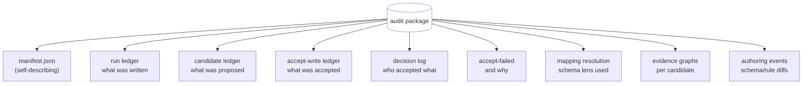

# Audit and provenance

Provenance and audit address two related but distinguishable questions. Provenance is the question of where a particular fact came from, and is a property of every individual entry in the ledger. Audit is the question of what happened in a particular run of the system, and whether a third party can reproduce or check it. The two are intertwined — an audit story made up of facts whose provenance has not been preserved is not much of an audit story — but the kernel handles them through different mechanisms, which the present page describes in turn. The page covers the metadata that travels with each fact, the records that travel with each run, the shape of the evidence that derivations produce, and the audit-package format that bundles all of these into a self-contained artifact suitable for archival and offline review.

## Provenance on every fact

Every entry in the ledger carries metadata describing the act of asserting it. The kernel itself contributes the timestamp at which the assertion was written and the assertion id by which the entry can later be referred to. Beyond that, the metadata is whatever the writing party chose to include, and although the kernel imposes no naming convention, a small set of keys recurs across factpy codebases: `source`, identifying the system or process responsible for the write; `trace_id`, tying multiple assertions from the same logical operation together; `confidence`, where applicable, for facts produced from probabilistic sources or model outputs; and any further keys an application finds useful — a reviewer's name, a request id, a batch identifier.

Provenance is local to the assertion rather than to the entity. If a person's name was set by an import job at t=10 and corrected by a reviewer at t=50, the ledger holds two distinct assertions with two distinct metadata blocks; the snapshot reduces them to the latest non-retracted value, while the audit story preserves both, with the source, the time, and the further keys of each. This is the property a mutable-row store cannot offer: a row carries at most the metadata of the most recent writer, and the act of overwriting the previous value also overwrites whatever traces of its origin existed alongside it. The append-only ledger is constructed to make that loss impossible.

## Records of every run

Provenance accounts for facts; audit accounts for operations. Beyond the metadata of each individual write, the kernel records, for each run of any kind, enough structured information to reconstruct what was done. A rule run records the rule's id and version, the ledger state it ran against, and the rows it returned. A derivation evaluation records the derivation, its body or bodies, the candidates produced, and the supporting ledger entries for each candidate. An acceptance records the candidate accepted, the reviewer or process that accepted it, the new ledger entries that resulted, and the evidence preserved as provenance on those entries. An authoring change to a schema, rule, or derivation records an apply event together with the diff that produced it. The records are structured enough to be replayed: given the same ledger state and the same rule, the same output is produced. Where a step depends on something the kernel cannot itself reproduce — a non-deterministic adapter, an external service called during evaluation — the dependency is itself recorded as part of the run rather than left implicit.

## Evidence: trees and graphs

When a derivation produces a candidate, the kernel attaches an evidence record that names the rule and its version and identifies every ledger entry that supported the match. Under the native evaluator, the record takes the shape of a tree. The candidate is the root, the body matches are its children, sub-rule references via `RuleRef` produce further children, and the leaves of the tree are the concrete ledger entries that satisfied the body's atoms.

```
candidate:  Person.tag(alice, "vip")
└── derivation: drv.vip_inference v1.0.0
    └── body 1 (confidence=0.95)
        ├── Person(alice)             ← entry #140
        ├── Person.locale(alice,"en") ← entry #141
        └── profile:vip(alice, true)  ← entry #142
```

Under engines whose reasoning is not tree-shaped — PyReason, with its propagation through a graph over discrete time steps; ProbLog, with the proof structures it produces for some queries — the evidence record is itself a graph rather than a tree. A tree cannot faithfully represent a propagation in which beliefs reach the same conclusion through several routes, nor a probabilistic inference whose argument structure is a directed acyclic graph rather than a hierarchy. The kernel exposes the graph form as an `EvidenceGraph` with typed nodes — `seed`, `premise`, `conclusion` — and typed edges — `supports`, `derives`, `updates` — together with a layout hint that lets renderers choose between tree and timeline displays. The shape of the graph is engine-agnostic; the content is engine-specific, since a native trace, a PyReason propagation, and a ProbLog inference each say different things about how their conclusions were reached, even when those conclusions happen to be the same fact.

## The audit package

An audit package is a self-contained directory that bundles a run, or a set of runs, into an artifact suitable for archival, transfer, or offline review. It is the format in which a factpy system makes its audit story portable, and it is produced by a single call to `sdk.export_package`.



The package separates four concerns into distinct files. The facts are in the run ledger. The candidates produced by derivations during the run, together with the evidence supporting each, are in the candidate ledger and in the per-candidate evidence records. The decisions made about those candidates — which were accepted, by whom, which were rejected and why — are in the decision log and the accept-write ledger. The schema and rule versions in use during the run, together with any authoring changes, are recorded as machinery alongside the rest. A top-level manifest declares the package's kind and lists the relative paths of every component, so that a reader does not need to know the internal layout in order to navigate the package; the manifest is the authoritative index and is the file an audit reader should open first.

A package is reproducible to the extent its inputs are. Schema and rule versions are captured exactly. Run ledgers and candidate ledgers are deterministic outputs of the writes and the rules. Evidence graphs are deterministic outputs of the engine that produced them. Where an adapter engine admits a non-deterministic component — a wall-clock timeout, a stochastic solver — the relevant configuration is captured alongside the result, so that the conditions of the run remain recoverable even where the output is not bit-for-bit reproducible.

## Reading audit packages offline

The `kernel.audit` module reads audit packages without depending on the rest of the kernel.

```python
from kernel.audit import load_audit_package

pkg = load_audit_package("./audits/run-2024-04-01")
print(pkg.manifest["package_kind"])    # "audit"
print(len(pkg.candidate_ledger))       # candidates produced
print(len(pkg.accept_write_ledger))    # candidates accepted
```

`load_audit_package` returns the package's contents as plain data: the manifest as a parsed JSON object, the various ledgers as lists of jsonl-decoded entries, the evidence graphs as `EvidenceGraph` instances, the decision log as a list of decision entries. From these, applications and reviewers construct whatever views the situation calls for — a compliance summary tabulating decisions by reviewer, a per-rule trace showing which versions ran when, a single candidate's full evidence tree, a timeline reconstructing how a particular fact came to be true. The kernel ships builder functions for the most common of these views, among them `build_decision_detail_dto`, `build_rule_trace_detail_dto`, and `build_candidate_evidence_tree_dto`, both as ready-made navigation for applications that do not want to write their own and as worked examples of what each slice of the package contains.

## Why audit and provenance are part of the kernel

Audit features attached to a system after its core has been built tend to be partial in a characteristic way. They record what could be observed at the integration points the system already had — a database trigger here, a request log there, a periodic snapshot of state — and the result is a reconstruction rather than a record, with gaps wherever an operation happened to fall between the available observation points and with no guarantee that the observed pieces fit together into a coherent story.

factpy puts the integration points where they actually need to be by making them part of the core. Every fact is an assertion with provenance, every rule run is an operation with a record, every derivation produces a candidate with evidence, every acceptance creates a decision log entry. The audit package is no more than these records collected into a directory; nothing in it is reconstructed after the fact, because nothing was discarded as the records were being made. The cost of this design — the additional metadata travelling with every operation, the additional structure travelling with every candidate — is what buys an audit story that is not a separate report but the same data structure used during the run, written out to a directory afterwards.

## Where to next

The [auditing a run guide](/docs/guides/auditing-a-run) walks through producing an audit package from a real workflow and reading it back. The reference for `kernel.audit` covers the package layout, every builder DTO, and the evidence-graph node and edge taxonomy in full. For the mechanism by which provenance enters the ledger in the first place, see [the ledger](/docs/concepts/the-ledger) and [rules and derivations](/docs/concepts/rules-and-derivations).