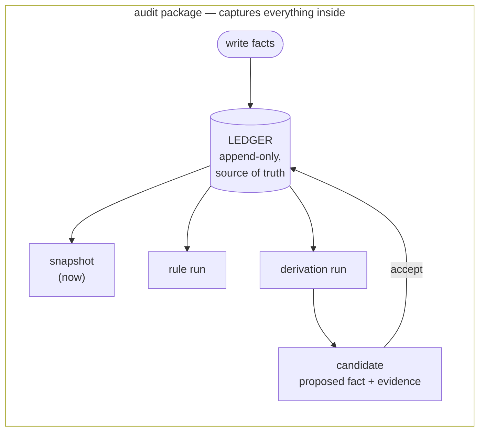

# Overview

The architecture of factpy reflects a single decision about how state is held: every claim about an entity is recorded as an independent fact, and the entity's current state is computed from those facts on demand rather than maintained alongside them. There is no row to be updated and no document to be replaced. An entity is the projection of everything ever asserted about it, reduced under the schema's rules at the moment a snapshot is taken. Each of the kernel's other components — schema, rules, derivations, audit packages — exists to make that mode of working tractable and to preserve the trail of evidence the design implies. This page describes the architecture at a single level of detail; the four concept pages that follow take up each component in turn.

## Facts

A fact in factpy is the smallest possible claim about the world: a predicate, a subject, a value, and the metadata that accompanied the act of writing it down. The claim that a particular person is named *Alice*, written by an import job on a particular day, is one fact. If a later process records that the same person is now named *Alicia*, the second writing produces a second fact rather than a modification of the first; both remain in the record, distinguishable by their timestamps and by the metadata of their origin.

Holding state this way is not in itself unusual — event logs, accounting ledgers, and version-control histories all share the basic shape — but factpy makes the consequences of that shape its primary commitment. Two sources that disagree about the same predicate produce two facts, and the disagreement is preserved rather than resolved by overwriting. The temporal structure of how an entity reached its current state is available without any separate instrumentation. The provenance of a particular claim is local to the claim itself, not derived backwards from a row that several actors have touched in succession. The snapshot of an entity at any moment is computed by reducing the relevant facts according to each field's cardinality rule: single-valued fields take their latest active assertion, multi-valued fields take the union of theirs, and entries that have been retracted are skipped over. The history is never lost, only filtered out of the snapshot view.

## The ledger

The structure that holds the facts is called the ledger, and it is append-only in the strict sense that a write produces a new entry and never modifies or removes a previous one. The SDK exposes write operations whose names will be familiar from ordinary stores — `set`, `add`, `retract` — but each of these is a translation into a ledger append, not an in-place mutation of state the SDK keeps elsewhere. A retraction in particular does not remove the assertion it targets; it is a new entry that, when the snapshot is recomputed, causes the projection to skip the targeted assertion. The ledger preserves both the original claim and the act of withdrawing it, and an audit reader sees both in their proper order.

The ledger is the single source of truth in a factpy system. A snapshot of an entity, the rows produced by a query, and the candidates proposed by a derivation are all projections of the ledger; none of them holds independent state, and any of them can be reproduced by replaying the ledger up to the relevant point.

## Schema

A schema in factpy is a vocabulary rather than a layout. The classes that subclass `Entity` declare the kinds of things the system can hold facts about, and the `Identity` and `Field` declarations within them establish which coordinates locate an entity and which predicates are available for assertion. There is no table, no row layout, no fixed column order — only a set of typed predicates and the cardinality with which each of them combines under projection.

This narrows the role the schema plays. It does not define how facts are stored, since every fact is stored the same way. It defines what facts are *legible* — the predicates the projection knows how to reduce, the value domains assertions must occupy, the relationships through which rules can join. A schema change that preserves legibility, such as adding a new field or a new entity, requires no migration and no digest bump. A change that does not preserve legibility, such as renaming a field or altering a cardinality, is detected at open time by a content hash over the schema and refused until the migration is performed deliberately.

## Rules

A rule expresses a question to be answered against the ledger. Its body lists the conditions that must hold simultaneously for some binding of logic variables, and its head names what should be returned for each binding that satisfies the body. The conditions can constrain a single entity, join across entities through shared variables or through reference fields, fail when a corresponding assertion is *not* present in the ledger (the semantics being negation as failure rather than explicit negation), and invoke other named rules in order to compose larger queries from smaller ones.

A rule is both a query that can be run for its rows and a named definition that other rules can refer to by identifier. Each rule carries a version, and running one records, in the audit trail, which version was evaluated against which ledger state and what rows it produced. Two versions of the same rule will, in general, produce different answers from the same ledger, because the body has been changed deliberately; the audit story keeps both runs distinguishable so that a result obtained yesterday under one version is not silently confused with a result obtained today under another.

## Derivations

A derivation is a rule whose head proposes new facts rather than returning them as data. Each binding that satisfies the body produces a *candidate* — a fact in the shape the head specifies, accompanied by the rule's identity and version and by the ledger entries that supported the match. A candidate is not yet a fact in the ledger; it is a proposal awaiting decision.

Acceptance is a separate step. A call to `sdk.accept`, or to `sdk.accept_many` in batch, writes the candidate into the ledger as an ordinary assertion and retains the candidate's evidence as that new entry's provenance. Each acceptance is recorded in a decision log alongside the resulting writes, so that no fact is committed to the ledger without an identifiable act of judgment behind it. The consequence is that every fact in the ledger is either directly written or accepted from a candidate by a deliberate decision, and every derived fact remains traceable both to its supporting facts and to the rule and the moment of acceptance that produced it. This division of labour — evaluation produces candidates, a separate step accepts them — is what distinguishes an inference system that can be audited from one that cannot. An engine that writes its conclusions straight into shared state loses the moment at which any particular conclusion was endorsed; factpy preserves that moment by construction.

## Audit

Because provenance is local to each fact, because the rule registry records every version that has ever run, because the candidate ledger records every proposal evaluated, and because the decision log records every acceptance, no further bookkeeping is needed in order to reconstruct what a system has done. A complete *audit package* is the union of those records, serialised as a self-contained directory and produced by a single call to `sdk.export_package`. The package can be archived, reviewed in a separate process, or read back through the small `kernel.audit` module without any of the rest of the kernel. It is not a secondary artifact assembled retrospectively for compliance; it is the same data the system uses to reason about itself at runtime, written out in a portable form. Producing one is mechanical because nothing was discarded while running.

## How the parts compose

A factpy program of any size combines these elements in some proportion. Most application code writes facts and reads snapshots; some of it runs rules and queries; the parts that draw conclusions evaluate derivations and accept some of the candidates they produce; review and post-hoc analysis read audit packages produced from those runs. Each of the moves contributes to the same record, and the record itself is what makes the rest of the system answerable to scrutiny.

## Where to next

[Entities and fields](entities-and-fields.md) develops the schema layer. [The ledger](the-ledger.md) develops the append-only model and the mechanics of projection in detail. [Rules and derivations](rules-and-derivations.md) develops the reasoning layer end to end. [Audit and provenance](audit-and-provenance.md) develops what is recorded during a run, what an exported package contains, and how it is read back. The [quickstart](../quickstart.md) covers the same architecture in working code for readers who would rather see it run before reading further about it.