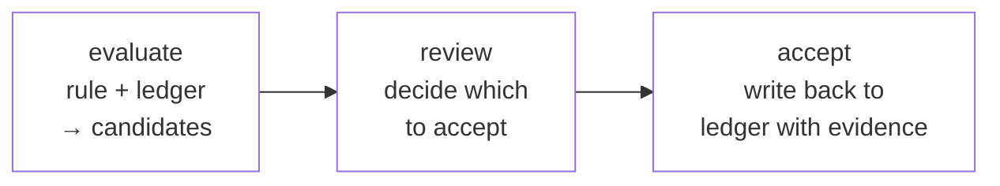

# Rules and derivations

The reasoning layer of factpy is a small logical language built directly over the ledger. A rule declares the conditions under which a body of clauses is simultaneously satisfied for some binding of variables, and returns those bindings as rows. A derivation is a rule whose head, instead of projecting the bindings as rows, names new facts to be proposed when the body matches. Both kinds of object are evaluated by the kernel against the ledger, both carry stable identifiers and explicit versions, and both leave a trace of their evaluation that participates in the audit story. The present page describes the shape of a rule, the language in which its body is written, the relationship between running a rule as a query and running one as a derivation, and the candidate-and-acceptance lifecycle that distinguishes a system that infers auditably from one that does not.

## Anatomy of a rule

A rule is constructed in Python as a `Rule` object whose two structurally distinguished parts are a `select` head and a `where` body.

```python
with vars("p", "n") as (p, n):
    vip_in_good_standing = Rule(
        id="q.vip_ok",
        version="1.0.0",
        select=[n],
        where=[
            Person(p),
            Pred("person:tag", p, "vip"),
            Not([Pred("person:tag", p, "blocked")]),
            p.name == n,
        ],
    )
```

The `select` head specifies what is returned for each binding of the body's variables that satisfies the body, in this case the variable `n`. The `where` body is a list of clauses that must hold simultaneously, expressed in a small fixed vocabulary of atoms.

Four atom forms appear in practice. The atom `Pred(predicate, subject, value)` requires that the ledger contain an active assertion of the named predicate, with the given subject and value; in the example above, `Pred("person:tag", p, "vip")` requires that `p` carry the tag `vip`. The atom `Not(...)` negates a list of clauses under the semantics of negation as failure, taken up in its own subsection below. The atom `EntityClass(var)` — for example, `Person(p)` — declares that the variable ranges over instances of that entity class and serves both as a typing declaration and as a join clause when other atoms refer to fields on the variable. And field-equality expressions written directly on entity-typed variables — `p.name == n`, `p.locale == "en"` — bind a field's value to a variable or constrain it to a literal; these are typed shorthands for the corresponding `Pred` atom, and are preferred where the predicate name is itself uninteresting at the call site.

Variables are produced by the `vars(...)` context manager, which yields one logic variable per name supplied to it. The names serve as display labels in row dicts and in audit traces; reusing the same string in two `vars(...)` blocks creates two distinct variables. The rule's `id` and `version` are not decorative: they are the identifiers under which the kernel registers the rule, refers to it in audit records and evidence trees, and resolves references from one rule to another. A change to a rule's body that alters the set of bindings the rule would produce against the same ledger warrants a new version, since the audit trail relies on the version to distinguish runs of one rule from runs of another.

## Rules as queries

The simplest use of a rule is to run it for its rows.

```python
sdk.run(vip_in_good_standing, row_format="dict")
# [{'n': 'Alice'}]
```

`sdk.run` returns a list of rows, each row carrying one set of values for the variables named in the head. The default row format is `"dict"`, with the variable names as keys; the alternatives are `"tuple"`, which omits the names and returns positional rows useful for downstream consumers, and `"instance"`, which is appropriate when the head is a single entity-typed variable and returns the matching entities as snapshots of the same shape that `sdk.get` would produce. A default may be configured at store-open time via `default_row_format=`; per-call `row_format=` overrides it.

A rule run is a projection of the ledger in the sense developed in [the ledger](the-ledger.md). Given the same ledger and the same rule, the same rows are produced; the rule does not write back to the ledger in the course of its evaluation, and a query that returns no rows is not a sign that anything has changed but a statement of fact about the ledger as it stands.

## Rules as definitions

A rule is also a named, reusable construct. Once a rule has been declared, another rule can refer to it inside its own body via `RuleRef`, which injects the referenced rule's body into the calling rule's body with the variables bound through to the call site.

```python
with vars("p") as (p,):
    high_priority = Rule(
        id="q.high_priority",
        version="1.0.0",
        select=[p],
        where=[
            RuleRef(vip_in_good_standing)(p),
            Pred("person:tag", p, "active"),
        ],
    )
```

`RuleRef(vip_in_good_standing)(p)` makes the *vip in good standing* condition a sub-clause of the *high priority* rule's body, with `p` flowing through as the matched person. The substantive consequence is that exactly one definition of *vip in good standing* exists, and any change to it propagates to every rule that references it; a copy-pasted alternative would have neither this propagation nor the audit-side benefit that the dependent rule's evidence record names the referenced rule by id and version, so that an audit reader can trace a *high priority* match back through the *vip in good standing* condition that licensed it. The cross-module form `RuleRef("q.vip_ok", version="1.0.0")` is available where the rule object itself is not in scope, and is the idiomatic shape for references between separate modules.

This composition is what permits a vocabulary of named concepts to be built up over the predicates of the schema, with each concept addressable by name and version rather than restated wherever it is used.

## Negation as failure

The atom `Not(...)` negates a list of clauses, and the natural reading of *not blocked* is the one most application code wants. The semantics, however, is precise and worth understanding, because it is not the semantics of explicit negation. A `Not` clause succeeds when the ledger does not currently support its body and fails when the ledger does. There is no representation in the ledger of *not blocked* as a positive claim; what the rule is testing is the *absence* of an assertion that the subject is blocked, not the *presence* of an assertion that the subject is unblocked.

The distinction matters in two situations. When data arrives over time from multiple sources, a rule that returned *Alice is not blocked* before some ingestion may return the opposite afterwards, with no change to the rule itself; the rule's conclusion is correct against the ledger it ran against, but the ledger has changed under it. When a rule's intent is to express that a positive claim of *not* something has been recorded, the negation operator is the wrong tool, and the right model is an explicit field on the entity (`Person.status == "active"`) that some upstream actor sets affirmatively, with the rule querying that field positively rather than negating its complement.

Because every rule run is recorded together with a reference to the ledger state it ran against, the audit trail preserves what a rule's answer was at a particular time and against a particular set of assertions. A flipped conclusion is therefore visible as a flipped conclusion, with the change in inputs that produced it, rather than appearing as an inconsistency between two runs.

## Derivations

A derivation has the same body language as a rule and the same identity-and-version surface. The structural difference is in the head: where a `Rule` projects its variable bindings as rows, a `Derivation` declares a fact-shaped head that names what should be proposed for each binding the body satisfies.

```python
with vars("p", "loc", "nm") as (p, loc, nm):
    auto_alias = Derivation(
        id="drv.auto_alias",
        version="1.0.0",
        where=[Person(p), p.locale == loc, p.name == nm],
        head=Person.tag(locale=loc, tag=nm),
    )
```

The head `Person.tag(locale=loc, tag=nm)` is a field call. Identity coordinates and the field value are read from the body's bindings, and one such head fact is proposed per binding the body satisfies. A derivation may also declare a list of head field calls when one body match should produce several related facts together.

`sdk.evaluate(derivation, mode="native")` runs a derivation against the current ledger. The return value is not a list of rows but a list of *candidates* — proposed facts in the shape of the head, each one bundled with the evidence that produced it. Until accepted, candidates are not part of the ledger; they are the kernel's offer of what would follow from the rule given the current state, with no commitment that the offer should be taken.

The substantive difference between writing a fact directly and arriving at it through a derivation lies not in the fact itself but in what kind of statement places it in the ledger. A direct write is the assertion of a result; a derivation is the assertion of a rule together with the observation that, against the current ledger, that rule licenses the proposed fact. The two yield indistinguishable values in the snapshot, but a direct write can only be confirmed by trusting its writer, whereas an accepted derivation can be re-evaluated against the ledger of its time and the conclusion checked independently. A system that wrote derived conclusions directly would throw the form of the argument away and retain only the result; the separation between rule, candidate, and acceptance is what preserves the argument as part of what the system records.

## Candidates and evidence

A candidate is not merely the head fact a derivation would write. It is the head fact together with a structured account of what produced it: the rule's identity and version, the binding of body variables that satisfied the match, and the ledger entries that supported each clause of the body. The conceptual shape of a candidate, written out for the example above, is the following.

```
candidate:    Person.tag(person_id="alice", locale="en", tag="Alice")
produced by:  drv.auto_alias v1.0.0
supported by:
  - Person(alice)               ← entry #140, source=import_job, t=10
  - Person.locale(alice, "en")  ← entry #141, source=import_job, t=10
  - Person.name(alice, "Alice") ← entry #142, source=import_job, t=10
```

The supports are themselves ledger entries with their own provenance, which means that when a candidate is accepted and becomes part of the ledger, the chain of evidence remains intact: the audit reader can ask, of any derived fact, what rule produced it, against what binding, on the basis of which entries, each of which carries the metadata of its origin. Where derivations chain — when an accepted derived fact participates in the body of a further derivation — the evidence carries forward, and the chain back to the leaf assertions remains traceable however many steps long it grows.

## Evaluate, review, accept

The lifecycle of a derivation falls into three steps. Evaluation runs the derivation against the ledger and produces candidates without writing anything; the operation is read-only and side-effect-free, and the same evaluation against the same ledger yields the same candidates. Review is the step at which a decision is made about which candidates ought to be accepted; the decision may be programmatic, such as a filter on the candidates' confidences or a policy that accepts every candidate from a trusted derivation, or it may involve a human reviewer in an interface, or it may be rendered trivial by a policy that accepts all candidates as a matter of standing decision. Acceptance writes the accepted candidates as new assertions in the ledger and preserves their evidence as provenance on the new entries; it is a separate operation from evaluation, and the separation is the architectural point.



The architectural significance is that every fact in the ledger is either directly written or accepted from a candidate by a deliberate decision, and the decision is itself recorded in a decision log alongside the resulting writes. There is no third category of facts that arrived in the ledger because some engine concluded they should be there; if a fact is in the ledger, an identifiable act of writing or accepting put it there, with the metadata of who and when. This is the property that distinguishes a reasoning system whose conclusions can be reviewed from one whose conclusions can only be reproduced. The kernel exposes `sdk.accept` for individual candidates and `sdk.accept_many` for batches, both of which support a `dry_run` mode that previews the writes without committing them; where multiple accepts are batched, the operation can be configured as atomic — all-or-nothing — or to commit what it can on a best-effort basis when individual accepts fail.

## Confidence and multiple bodies

A derivation may have more than one path to the same conclusion, with different levels of trust associated with each. An entity might be classified by an explicit profile flag with high confidence, or by behavioural signals from a model with lower confidence, with both arriving at the same head conclusion. The DSL expresses this through a multi-body derivation in which each body is wrapped in `Body(...)` and tagged with its confidence.

```python
with vars("p", "loc", "tg") as (p, loc, tg):
    vip_inference = Derivation(
        id="drv.vip",
        version="1.0.0",
        where=[
            Body([Person(p), p.locale == loc, Pred("profile:vip", p, True)],
                 confidence=0.95),
            Body([Person(p), p.locale == loc, Pred("model:high_value", p, tg)],
                 confidence=0.6),
        ],
        head=Person.tag(locale=loc, tag="vip"),
    )
```

Each body is an alternative match path, and the bodies are or-joined: a candidate is produced for any binding that satisfies any of them. Candidates carry the confidence of the body that produced them, which a review step can branch on — accepting high-confidence candidates automatically and routing low-confidence ones to a human reviewer, for instance. The confidence value is opaque to the native evaluator: it travels with the candidate as a number but does not enter into the evaluation as a probability.

For reasoning that does treat confidence as a probability and combines it correctly under joint distributions and marginalisation, factpy delegates to ProbLog through the optional adapter layer. The same `Derivation` object runs under either evaluator; what changes is the semantics under which the confidence is interpreted.

## Adapter engines

The native evaluator handles logical rules with negation, joins, and rule composition over fact bases of moderate size, and is the right tool for the majority of derivations a typical project will write. For three reasoning shapes that the native evaluator does not address, factpy provides engine adapters that take the same `Rule` and `Derivation` declarations and run them under a different evaluator.

PyReason is suited to graph-shaped reasoning in which beliefs propagate along typed relationships in discrete time steps; the engine works on annotated logic with confidence intervals and is the appropriate choice when the reasoning is itself propagation and the data has the shape of a typed graph with relationships that carry their own bounds. ProbLog is suited to probabilistic logic programming in which inputs have probabilities and rules combine them under joint distributions; the engine returns marginal probabilities and is the appropriate choice when the confidence values are meant as probabilities and the application requires that they be combined correctly. Souffle is a compiled Datalog engine that evaluates large rule sets by emitting native code; it is the appropriate choice when the native evaluator's performance ceiling has been reached against fact bases of substantial size, and the reasoning shape itself is plain Datalog.

What the adapters share is that the DSL is unchanged, the audit story is unchanged, and the candidate-and-acceptance lifecycle is unchanged in those cases where the adapter produces candidates. What differs is the evaluator that consumes the rule and the shape of the evidence the engine produces: the native evaluator's evidence is a tree, while engines whose reasoning does not reduce to a tree produce an `EvidenceGraph` whose richer structure the audit module exposes through dedicated builders.

## Where to next

[Audit and provenance](audit-and-provenance.md) develops the recording and export side of the rule and derivation lifecycle. The [writing rules guide](../guides/writing-rules.md) walks through real-world rule patterns — joins, negation, rule composition — for readers approaching the same material from the practical side. The [running derivations guide](../guides/running-derivations.md) covers the ergonomics of the evaluate-and-accept cycle in production. The [using adapters guide](../guides/using-adapters.md) develops the choice and configuration of the three adapter engines.