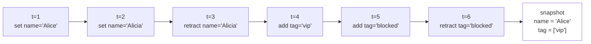

# The ledger

Every assertion and every retraction made through the SDK is appended to the ledger as a new entry. Once written, an entry is never modified or removed. Snapshots, query results, and the inputs to rule evaluation are all projections of the ledger, computed on demand and held nowhere else as canonical state. If the schema is the vocabulary in which claims are made, the ledger is the substrate in which the claims accumulate, and the present page describes what an entry actually contains, how reads project the entries into the shapes the rest of the system consumes, and why the design rests on append-only writing rather than on the more familiar overwriting model.

## What an entry contains

Each entry records a single act of writing, and the kernel preserves enough information about each act to make it interpretable in isolation. An entry carries the predicate the act concerns — that is, the schema field, expressed in its lowercase `entity:field` form — together with the subject the act is about, identified by the entity's type and identity coordinates. It carries the value being asserted, or, in the case of a retraction, the identifier of the prior assertion being withdrawn. It carries the action being performed, which may be `set` for a single-valued assertion, `add` for a multi-valued assertion, or `retract` for the explicit withdrawal of an earlier assertion. And it carries a metadata block consisting of the timestamp the kernel stamped on the entry, the assertion id by which the entry can be referred to in subsequent operations, and any further keys the writing party supplied — by convention, `source`, `trace_id`, `version`, `valid_from`, and `confidence`, though the kernel imposes no such convention beyond requiring that the values be JSON-friendly. Once written, the entry is immutable: a ledger written yesterday and reopened today is byte-for-byte identical to itself.

## What `set`, `add`, and `retract` actually do

The three direct-write entry points of the SDK reduce to the same primitive operation against the ledger, which is the appending of a new entry. They differ in the cardinality of the field they target and in what each is taken to mean by the projection that later reduces the ledger into a snapshot. A call to `sdk.set(Person.name, ref, "Alice")` writes an assertion against a single-cardinality field; calling it again with `"Alicia"` writes a second, separate entry rather than overwriting the first, and both entries remain in the ledger indefinitely. A call to `sdk.add(Person.tag, ref, "vip")` writes an assertion against a multi-cardinality field, and a subsequent call with the same value writes a further entry, distinct in metadata and timestamp, even though the projection collapses the two into a single tag in the snapshot. A call to `sdk.retract` does not remove its target; it appends a retraction entry that refers to the prior assertion by its id, and any later projection skips the targeted assertion when it reduces. The general property holds without exception: writes do not modify earlier entries, and any change in observable state is the consequence of an additional entry that the next read will incorporate.

## Snapshots as projections

A snapshot is the answer the kernel returns when asked for the current state of a particular entity, and it is the most common shape in which the ledger is read. The snapshot is not held anywhere as canonical state. When a call to `sdk.get(Person, person_id="...")` is issued, the kernel walks the entries pertinent to that entity and reduces them according to the cardinality declared on each field in the schema. Single-cardinality fields take the most recent non-retracted assertion; multi-cardinality fields take the union of all non-retracted assertions, with duplicates collapsing in the projection while remaining distinct in the ledger; identity fields are read directly from the entity's address rather than from any assertion, since identity values are not held as facts at all. The snapshot returned is read-only, and an attempt to assign to one of its attributes raises rather than silently mutating projection state that has no canonical existence to mutate.

The pseudo-timeline below shows the result of six writes against one entity together with the snapshot that the kernel produces from them.



The retracted assertion of `name='Alicia'` remains in the ledger; the projection skips it, leaving the older `'Alice'` as the latest non-retracted single value. The retraction is itself a ledger entry with its own timestamp, its own metadata, and an explicit reference to the assertion it withdrew, so that an audit reader can recover not merely the fact that some assertion was withdrawn but who withdrew it, when, and on what grounds. The snapshot is reproducible: the same ledger fed through the same projection rules yields the same snapshot every time the projection runs, and against any historical cut of the ledger the same procedure yields the snapshot as it stood at that moment. This determinism is what distinguishes the snapshot from canonical state: it carries no information the ledger does not already support, and it can be recomputed at any later time without consulting any other source.

The default projection follows the cardinality rules above. The kernel additionally supports named *views*, which apply alternative reduction strategies — different confidence-aggregation policies, time cutoffs, source restrictions — to the same ledger and produce different snapshots from it. Views are introduced where they are needed in the guides; for the purposes of the conceptual track the default reduction is sufficient, and the property that snapshots are projections of the ledger holds for every view alike.

Query results obtained by running a `Rule` against the ledger are projections in exactly the same sense. The kernel reduces the ledger under the rule's body and returns the variable bindings that satisfy it; the cardinality of any particular field is one parameter of that reduction, and the rule's logical structure is another. The reasoning layer that builds on this is the subject of [rules and derivations](rules-and-derivations.md).

## Projections and derivations

The ledger participates in two structurally different operations, and keeping them apart is important because they superficially resemble one another while standing in very different epistemic relations to the data.

A *projection* is a pure reduction of the ledger. The kernel computes it without adding any information beyond what the entries themselves carry, and the result, given the same ledger and the same reduction rules, is the same on every run. Snapshots and query rows are projections in this sense, and a system reading them is reading something already implicit in the ledger.

A *derivation*, by contrast, is a rule whose head specifies new facts to be proposed when its body is satisfied. Running a derivation against the ledger produces *candidates* — facts in the shape the head specifies, derived from the ledger under the rule but not contained in the ledger until a separate step explicitly accepts them. Acceptance appends the candidate as a new assertion and preserves the candidate's evidence as provenance on the new entry. The architectural significance of the distinction is that everything in the ledger is either directly written or accepted from a candidate by an identifiable decision, while projections are read-only computations from those entries that introduce nothing new. The candidate-and-acceptance machinery is developed in full on the [rules and derivations](rules-and-derivations.md) page.

## Persistence

The ledger lives in memory by default. A store opened as `SDKStore.from_schema_classes([Person])` discards its contents when the process exits, which is the appropriate behaviour for tests and for short-lived computation. Persistence is opt-in by passing a `ledger_path`:

```python
sdk = SDKStore.from_schema_classes([Person], ledger_path="./data/factpy.db")
```

The file at the given path is a self-contained store. The first time the file is opened the schema's content digest is recorded into it, and on every subsequent open the kernel re-computes the digest from the schema being supplied and compares the two. If the schema's structurally meaningful parts have changed in a way that would render existing assertions illegible — a renamed field, a changed cardinality, an altered identity composition — the open fails with an explicit error rather than proceeding with a silent reinterpretation of the data. The mechanics of the digest, the distinction between legible and illegible changes, and the migration of old ledgers under new schemas are developed in detail in [persistence](../../guides/persistence).

## Why append-only

The cost of append-only writing is that the ledger grows monotonically, and whether that growth is acceptable depends on what one would otherwise be giving up. An overwriting store keeps the current value of each field and discards what came before; a row in a mutable table carries, at most, the metadata of the most recent writer; and the reconstruction of past state under such an arrangement is possible only to the extent that some auxiliary mechanism — a changelog, an audit table, an external log — has been instituted to preserve it independently. None of those mechanisms is fully reliable in practice, and most of them work against the grain of the database's own design, which is to keep one current value as efficiently as possible.

The append-only ledger is the inversion of that arrangement. Every assertion ever made is preserved with the metadata of its origin, every retraction is preserved as an event in its own right, and the current state of any entity is a projection that can be recomputed at will from the entries below it. Replay forward to any past moment is meaningful, because the entries that produced the state at that moment are still there. Provenance is local to each fact rather than aggregated backwards from a row that several actors may have touched in succession. The audit story factpy is built around — explaining why a fact is true, exporting a complete run for inspection by a third party — rests on these properties without further bookkeeping, and the cost of monotonic growth is the price of having them. For workloads in which none of these properties is relevant factpy is the wrong tool; for workloads in which they are, the design is what makes them tractable.

## Where to next

[Rules and derivations](/docs/concepts/rules-and-derivations) develops the reasoning layer that consumes the ledger and proposes additions to it. [Audit and provenance](/docs/concepts/audit-and-provenance) describes what is exported alongside the ledger when an audit package is produced. The [reading and writing guide](/docs/guides/reading-and-writing) covers the day-to-day mechanics — when `set` is the right call versus `add` versus `retract`, how to use batches, and how to carry write-time metadata coherently across a codebase — for readers approaching the same material from the practical side.