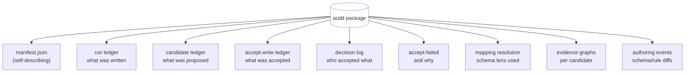

# Audit and provenance

Provenance and audit answer two related but different questions. *Provenance* asks: where did this particular fact come from? *Audit* asks: what happened in this run, and can someone else reproduce or check it?

factpy treats both as first-class. Every fact in the ledger carries provenance on its own; every run of the system — writes, queries, derivation evaluations, accepts — is recorded; and at any point you can package those records into an exportable artifact that is self-describing and re-readable offline.

This page covers what gets recorded, the shape of an audit package, and what `kernel.audit` lets you do with it once you have one.

## Provenance on every fact

When a fact is appended to the ledger, the entry carries metadata describing the act of asserting it. At minimum:

- **source** — what wrote the fact (an import job, an interactive session, a derivation accept).
- **timestamp** — when the assertion happened.
- **confidence** — optional; for facts derived from probabilistic sources or model outputs.
- **batch and trace metadata** — the batch the assertion belonged to and any custom keys attached at write time (`trace_id`, request id, reviewer name).

Crucially, provenance is local to *the assertion*, not to the entity. If a person's name was set by an import job at t=10 and corrected by a reviewer at t=50, the ledger has two assertions with two distinct provenance records. The snapshot shows the latest non-retracted one; the audit story shows both, with their respective sources, times, and reasons.

This is the property mutable-row systems can't reproduce. A row knows who *last* touched it. The ledger knows who touched it *every* time, and what the state of the world was each time.

## Records of every run

Provenance covers facts. Audit also covers *operations*.

Every rule run records: the rule's id and version, the ledger state it ran against, the rows it returned. Every derivation evaluation records: the derivation, its bodies, the candidates it produced, and the supporting ledger entries for each candidate. Every accept records: which candidate, which reviewer or process, the new ledger entries it produced, and the evidence preserved as provenance on those entries. Every authoring change to a schema, rule, or derivation records an apply event with its diff.

A run record is structured enough to be replayed: the same ledger state plus the same rule produces the same output. Anything that breaks that property — a non-deterministic adapter, an external lookup — is recorded as part of the run rather than hidden behind it.

## Evidence: trees and graphs

When a derivation produces a candidate, it does not just say *"this fact should be true"* — it produces an **evidence record** that names the rule, its version, and every ledger entry that supported the match.

For rules evaluated by the native engine, evidence has the shape of a tree. The candidate is the root; its children are the body matches; their children, in turn, are any sub-rule matches; and the leaves are concrete ledger entries:

```
candidate:  Person.tag(alice, "vip")
└── derivation: drv.vip_inference v1.0.0
    └── body 1 (confidence=0.95)
        ├── Person(alice)             ← entry #140
        ├── Person.locale(alice,"en") ← entry #141
        └── profile:vip(alice, true)  ← entry #142
```

For richer engines — graph propagation, probabilistic inference — evidence is a *graph* rather than a tree. Beliefs propagate, multiple paths reach the same conclusion, and a tree can't faithfully represent that. factpy captures this with an `EvidenceGraph`: typed nodes (`seed`, `premise`, `conclusion`) and typed edges (`supports`, `derives`, `updates`), with a layout hint for renderers.

The evidence graph is engine-agnostic in shape but engine-specific in content. A native trace, a PyReason propagation, and a ProbLog inference all produce the same kind of structure with content their respective engines understand.

## The audit package

An **audit package** bundles a run — or a set of runs — into a self-contained directory you can ship, archive, or re-read elsewhere. It is the artifact format of factpy's audit story.



Conceptually, a package separates the *facts* (the ledger view), the *proposals* (candidates and their evidence), the *decisions* (which were accepted, by whom, and which were rejected), and the *machinery* (the schema and rule versions that were in use). Each piece is in its own file, referenced by a top-level manifest that declares the package as an audit package and lists the relative paths.

A package is reproducible to the extent its inputs are. The manifest captures schema and rule versions; the run ledger captures the writes; the evidence graphs capture engine traces. Given the same inputs, replaying produces the same outputs, and the package itself is the witness for that claim.

## Reading audit packages offline

Audit packages are not just for the system that produced them. The `kernel.audit` module reads them back without any of the rest of factpy:

```python
from kernel.audit import load_audit_package

pkg = load_audit_package("./audits/run-2024-04-01")
print(pkg.manifest["package_kind"])    # "audit"
print(len(pkg.candidate_ledger))       # candidates produced
print(len(pkg.accept_write_ledger))    # candidates accepted
```

`load_audit_package` returns the package's contents as plain data structures — manifests, jsonl-decoded ledgers, evidence graphs, decision logs. From there you can build whatever view you need: a compliance matrix, a per-rule trace, a candidate's full evidence tree, a timeline of how a single fact came to be true.

The kernel ships builder functions for the common views — run lists, run details, decision details, evidence-tree narratives, rule-trace summaries — so applications and reviewers don't have to reinvent the navigation layer. They are also useful as documentation of what the package *contains*: each builder is a worked example of one slice of the data.

## Why this is at the kernel layer

Audit features bolted onto a system after the fact tend to be partial. They record what was easy to record at the seams the system already had. When the seams are in the wrong place — under a mutable row, after a write has already happened — the audit story becomes a best-effort reconstruction.

factpy makes the opposite trade. The seams are *always* in the right place because the system is built around them. Every fact is an assertion with provenance; every operation is a run with a record; every conclusion is a candidate with evidence; every accept is a decision log entry. The audit package is not a separate report; it is what falls out when you collect those records into one directory.

This is what makes the audit story usable rather than ceremonial. Nothing is reconstructed; everything was already there.

## Where to next

- The [Auditing a run guide](../guides/auditing-a-run.md) (when written) walks through producing an audit package from a real workflow and reading it back.
- The [reference for `kernel.audit`](../reference/audit.md) (when written) covers the package layout, every builder DTO, and the evidence-graph node/edge taxonomy in full.
- For how provenance gets *into* the ledger in the first place, see [the ledger](the-ledger.md) and [rules and derivations](rules-and-derivations.md).