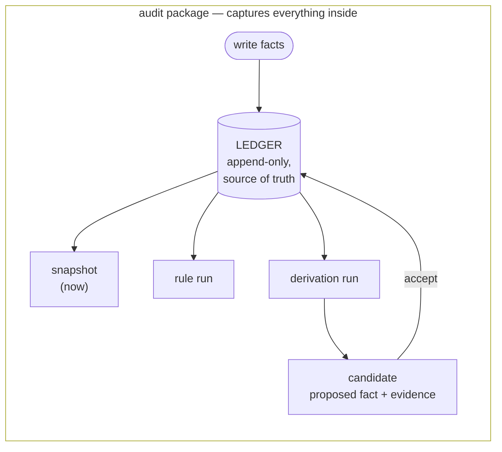

# Overview

factpy-kernel rests on one shift in perspective: instead of storing **records** (rows, documents, objects), it stores **facts** — small atomic claims about the world. A *user* isn't a row; it's the accumulation of every fact anyone has ever asserted about that user. State is something you *project*, not something you *update*. Every other piece of factpy — the schema, the rules, the derivations, the audit packages — exists to make that shift practical and ergonomic.

This page sketches the whole model on one page. Each piece has a deeper page of its own; the goal here is just to fit them together.

## Facts, not records

A fact in factpy is an assertion of the form: *predicate, subject, value, with metadata*. For example:

> The `name` of the entity `Person(p-1)` is `"Alice"`, asserted by the import job, on 2024-04-01.

That fact stands on its own. It is not a row that can be updated. If tomorrow someone says her name is now `"Alicia"`, a *new* fact is asserted; the original one stays in the record.

This sounds pedantic until you see what it buys you:

- Conflicting claims live together. When two sources disagree, both remain visible.
- Time is preserved automatically. You never have to bolt on `updated_at` columns.
- Provenance is local to each fact, not to a row that may have been touched by anyone.

A *snapshot* of an entity — "what do we currently believe about Alice?" — is computed by reducing the relevant facts according to the field's cardinality rules. Single-valued fields keep the latest assertion; multi-valued fields accumulate them. The history is never lost; it just isn't what the snapshot shows.

## The ledger

Every fact lives in a structure called the **ledger**. The ledger is append-only: writes don't mutate previous entries, they add new ones.

You rarely touch the ledger directly. You interact with the SDK, which offers familiar-looking entry points (`set`, `add`, `retract`) and translates them into ledger appends. The ledger can run in memory for a test, persist to a file for a long-running service, or ship as part of an audit package.

The ledger is the single source of truth in factpy. Snapshots and query results are *projections* of the ledger — derived purely by reducing the facts under some rule, with no new information added. Derivation candidates are something different: proposals for *new* facts, derived from the ledger but not contained in it. None of these are independent state; all of them are reproducible from the ledger plus the rule that produced them.

## Schema: how you talk about facts

A `Person` class with `Identity` and `Field` declarations is not a database table. It's a *vocabulary*: a contract for what kinds of facts can exist about a person, and how those facts are addressed.

- An **`Identity`** is a coordinate. It locates the entity a fact is about. `person_id="p-1"` is how factpy knows which person you mean.
- A **`Field`** is a predicate. It defines a kind of claim that can be made — `Person.name`, `Person.tag`. The field's *cardinality* governs how multiple assertions to the same predicate combine into a snapshot value.

Fields can also reference other entities, which is what lets rules join across them. The schema gives you typed ergonomics without changing the underlying model: facts in, facts out, with the schema as the lens.

## Rules: questions over the ledger

A factpy rule is a small logic program. It says: *"a row appears in the result if these conditions hold over the current ledger."* Rules support pattern matching, joins across entities, references to other rules, and negation.

A rule is both a *query* (run it, get rows back) and a *definition* (give it a name and a version, reuse it inside other rules). Either way, a rule run is itself recorded. You can ask later: which rule, at what version, against which ledger state, returned which rows?

## Derivations: from rules to new facts

A **derivation** is a rule that, when it matches, *proposes a new fact* instead of just returning rows. The output is a list of **candidates**: each candidate is a proposed fact bundled with the evidence — the rule, its version, and the supporting ledger entries — that produced it.

Candidates are not automatically written. You explicitly **accept** them — programmatically, in batch, or as part of a review flow. Acceptance writes the new fact into the ledger, with the candidate's evidence preserved as provenance.

This three-step rhythm — *evaluate → review → accept* — is the heart of factpy's reasoning model. It is what separates an opaque inference engine from an auditable one. Anything the system "concludes" went through a moment where a human or a deliberate process said *yes*.

## Audit: the trail as a first-class output

Every fact carries provenance. Every rule run is recorded. Every derivation accept includes its evidence. Add it all up and you can produce a complete **audit package** for any run: the inputs, the rules, the candidates, the accepts, the resulting facts. The package is exportable, re-readable offline through `kernel.audit`, and self-describing.

Audit isn't an afterthought layered on top of the system. It's the natural by-product of building every other piece the way we did.

## How the pieces fit together

The audit package is drawn as the container because it really is one: a complete run captures the ledger state, every rule and derivation that ran against it, every candidate produced, and every accept that wrote back.

A factpy program, no matter how large, is some combination of these moves: writing facts, projecting snapshots, running rules, evaluating derivations, accepting candidates, exporting audit packages. The deeper concept pages and the guides will give you each of those moves in detail.

## Where to next

The remaining concept pages each take one piece of the model and zoom in:

- [Entities and fields](entities-and-fields.md) — the schema layer in depth
- [The ledger](the-ledger.md) — what append-only really means and how snapshots are computed
- [Rules and derivations](rules-and-derivations.md) — the reasoning layer end to end
- [Audit and provenance](audit-and-provenance.md) — what gets recorded, what gets exported, and how to read it back

If you'd rather see the model in code first, the [Quickstart](../quickstart.md) walks through it concretely in about thirty lines.