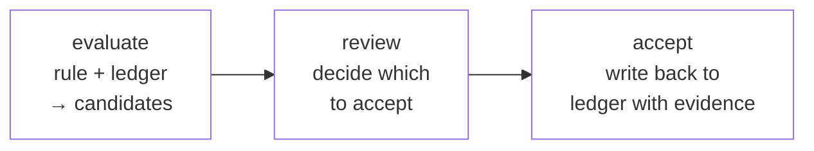

# Rules and derivations

Once you have facts in a ledger, you want to ask things of them. *"Who is a VIP and not blocked?"* *"Which submissions are missing required signatures?"* *"For each user, what's their derived tier?"* These are logical questions, and factpy answers them with a logical language: rules.

A **rule** is a small logic program that picks rows out of the ledger by stating the conditions a row must satisfy. A **derivation** is a rule that, when it matches, doesn't just return rows — it proposes new facts, with the matching ledger entries preserved as evidence. Together they make up factpy's reasoning layer.

This page covers the shape of a rule, how rules compose, the difference between running a rule as a query and running one as a derivation, and what the candidate-and-accept lifecycle gets you that an opaque inference engine wouldn't.

## What a rule is

A rule has two parts: a **head** (`select`) declaring what to return, and a **body** (`where`) declaring under what conditions a result is produced.

```python
with vars("p", "n") as (p, n):
    vip_in_good_standing = Rule(
        id="q.vip_ok",
        version="1.0.0",
        select=[n],
        where=[
            Person(p),
            Pred("person:tag", p, "vip"),
            Not([Pred("person:tag", p, "blocked")]),
            p.name == n,
        ],
    )
```

Three building blocks of the body language:

- **`Pred(predicate, subject, value)`** — *"this fact must hold."* `Pred("person:tag", p, "vip")` says: there must be an asserted fact that `p` has tag `vip`.
- **`Not([...])`** — *"this set of facts must not all hold."* Negation is performed *as failure*: the rule treats a fact as false if the ledger does not currently support it. We'll come back to this.
- **Variables** — `p` and `n` are placeholders bound by the body and projected by the head. Variables are produced by the `vars(...)` context manager.

Rules also carry an explicit `id` and `version`. This is not decoration: it is how factpy refers to the rule in audit records, evidence trees, and cross-rule references.

## Rules as queries

The simplest thing to do with a rule is run it:

```python
sdk.run(vip_in_good_standing, row_format="dict")
# [{'n': 'Alice'}]
```

Each row is a binding of the variables named in the head. By default rows come back as dicts; you can ask for tuples or for instance-shaped rows that include resolved entity refs.

A query is a **projection** of the ledger under a rule. The ledger is the input, the rule is the reduction, the rows are the output. Run the same rule against the same ledger and you get the same rows. No state mutates.

## Rules as definitions

A rule is also a *definition*. You can give it a name and reuse it inside another rule:

```python
with vars("p") as (p,):
    high_priority = Rule(
        id="q.high_priority",
        version="1.0.0",
        select=[p],
        where=[
            RuleRef(vip_in_good_standing)(p),
            Pred("person:tag", p, "active"),
        ],
    )
```

`RuleRef(vip_in_good_standing)(p)` injects the body of the named rule with `p` bound to the matching variable. This is composition, not duplication: if the underlying rule changes, the dependent rule changes with it, and both rules carry their identities forward into any downstream evidence record.

This is what lets you build a vocabulary of named concepts on top of raw facts. *VIP in good standing* becomes a thing; you can reference it from elsewhere; you can audit when and how it changed.

## A note on negation

`Not([...])` reads naturally — *"not blocked"* — but it is worth pausing on what it means.

factpy uses **negation as failure**: a `Not` clause succeeds when the ledger does not currently support the negated body. This is the right behaviour for most application code, but it has a sharp edge.

Suppose we ask for users who are *not blocked*, and the answer comes back as Alice. Two interpretations are tempting, and only one is right:

- **Wrong:** *"someone has asserted Alice is not blocked."*
- **Right:** *"the ledger contains no current assertion that Alice is blocked."*

The difference matters when your data comes from multiple sources at different times. If a source you haven't ingested yet would have told you Alice is blocked, the rule was correct *given what you knew* — but its conclusion may flip when that source arrives.

This is a property of the model, not a bug. It is one reason every rule run is recorded with a reference to the ledger state it ran against: a rule's answer is always relative to a particular ledger at a particular time, and the audit trail preserves that.

## From rules to derivations

A **derivation** has the same shape as a rule, with one change: instead of a `select` head that returns rows, it has a `head` that asserts new facts.

```python
with vars("p", "loc", "nm") as (p, loc, nm):
    auto_alias = Derivation(
        id="drv.auto_alias",
        version="1.0.0",
        where=[Person(p), p.locale == loc, p.name == nm],
        head=Person.tag(locale=loc, tag=nm),
    )
```

When you run a query, you get rows. When you run a derivation, you get **candidates**: proposals for new facts that the rule says should be true given the current ledger.

```python
candidates = sdk.evaluate(auto_alias, mode="native")
```

Crucially, candidates are *not yet in the ledger*. They are derived from it but have not been written back. This is the conceptual leap derivations make over plain queries: a query *reads*, a derivation *proposes a write that someone has to confirm*.

## Candidates carry their evidence

A candidate is not just "a proposed fact" — it bundles the proposal with the matching ledger entries that produced it. Conceptually:

```
candidate:  Person.tag(alice, locale="en", tag="Alice")
produced by:  drv.auto_alias v1.0.0
supported by:
  - Person(alice)                 ← fact #140, written by import_job @ t=10
  - Person.locale(alice, "en")    ← fact #141, written by import_job @ t=10
  - Person.name(alice, "Alice")   ← fact #142, written by import_job @ t=10
```

This evidence is what makes the proposal auditable. You don't just see *that* the system thinks Alice should have a tag; you see *why* — every supporting fact, traceable back to the ledger entry that asserted it, which carries its own provenance back to whatever wrote it.

When derivations chain (a derivation's head feeds another rule's body), candidates carry their evidence forward through the chain. Acceptance of a downstream candidate preserves the upstream support, all the way back to the leaf facts.

## Evaluate, review, accept

Derivations have a three-step rhythm:



1. **Evaluate.** Run the derivation against the current ledger. Get candidates back, with their evidence bundles. No state changes.
2. **Review.** Decide which candidates should become real facts. This step can be human (a reviewer in a UI), programmatic (any candidate above some confidence threshold), or trivial (accept all of them in batch).
3. **Accept.** Write accepted candidates to the ledger as new assertions. The candidate's evidence is preserved as provenance on the new fact.

This separation is the difference between a system that *infers* and a system that *infers auditably*. Anything in the ledger is either a fact someone wrote directly or a fact produced by a derivation that someone deliberately accepted. There is no third category; nothing "just appears because the engine thought it was true."

`sdk.accept(candidate, ...)` writes a single candidate. `sdk.accept_many(candidates, mode="atomic")` writes a batch. Both options support `dry_run=True` to preview the effect without writing.

## Confidence and multiple bodies

Real-world derivations often have more than one path to the same conclusion, with different levels of confidence. A user might be classified as VIP because of an explicit profile flag (high confidence) *or* because of behavioural signals from a model (lower confidence).

factpy supports this through multi-body rules:

```python
with vars("p", "loc", "tg") as (p, loc, tg):
    vip_inference = Derivation(
        id="drv.vip",
        version="1.0.0",
        where=[
            Body([Person(p), p.locale == loc, Pred("profile:vip", p, True)], confidence=0.95),
            Body([Person(p), p.locale == loc, Pred("model:high_value", p, tg)], confidence=0.6),
        ],
        head=Person.tag(locale=loc, tag="vip"),
    )
```

Each `Body` is an alternative way the derivation can match. Candidates produced by different bodies carry the body's confidence forward, and your review step can use that confidence to decide what to accept.

For genuinely probabilistic reasoning over uncertain facts — distributions over outcomes, joint probabilities — factpy can hand off to ProbLog via the optional adapter layer.

## External reasoning engines

The native evaluator handles plain logical rules with negation. For richer modes — graph-based propagation, probabilistic inference, or large-scale Datalog — factpy delegates to engine adapters:

- **PyReason** — graph-based annotated logic, useful for propagating beliefs through entity relationships.
- **ProbLog** — probabilistic logic programming over uncertain facts.
- **Souffle** — a fast Datalog engine for very large rule bases.

Each adapter takes the same `Rule` and `Derivation` definitions you have already written and runs them under a different evaluator. Candidates come back with evidence tied to that engine's reasoning trace (an `EvidenceGraph` rather than a flat tree, in the cases where the engine produces one).

You do not need to choose an engine up front. Start with the native evaluator and reach for an adapter when your reasoning shape demands it.

## Where to next

- [Audit and provenance](audit-and-provenance.md) — what gets recorded when rules run and candidates are accepted, and how to export and re-read it.
- The [Writing rules guide](../guides/writing-rules.md) (when written) walks through real-world rule patterns: joins, aggregations, named sub-rules.
- The [Auditing a run guide](../guides/auditing-a-run.md) (when written) covers how to take a finished derivation and turn it into a shareable audit package.