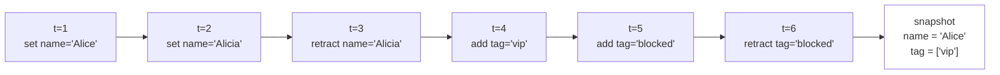

# The ledger

The ledger is the heart of factpy. Every fact you write — every assertion, every retraction — goes into it as a new entry, in order, forever. Nothing is overwritten. Nothing is deleted. The ledger *is* the state of your system; everything else you read out of factpy is computed from it.

If facts and entities give you the *vocabulary*, the ledger gives you the *medium*. This page covers what's actually in there, how snapshots and other reads are derived from it, and why we built it this way in the first place.

## What's in an entry

Every ledger entry records a single move: an assertion or a retraction. Conceptually each entry carries:

- **A predicate** — which kind of claim is this? (`Person.name`, `Person.tag`, ...)
- **A subject** — which entity is it about? Identified by entity type plus identity coordinates.
- **A value** — what is being asserted? For a retraction, the value identifies which prior assertion is being retracted.
- **An action** — `set` (single-valued assert), `add` (multi-valued assert), or `retract`.
- **Metadata** — a timestamp, a source, optional confidence, plus any meta keys you attached at write time.

Entries are sequential and never modified. They are ordered, durable, and complete: the ledger you wrote yesterday is still bit-for-bit the ledger you're reading today.

## What `set`, `add`, and `retract` actually do

These three SDK calls all do the same kind of thing under the hood: they append a new entry to the ledger. The differences are about *how the snapshot will reduce them later*.

- **`sdk.set(Person.name, ref, "Alice")`** appends a new assertion of a single-valued field. If you call it again with `"Alicia"`, that's another new entry, not an overwrite of the first. Both entries live forever in the ledger.
- **`sdk.add(Person.tag, ref, "vip")`** appends an assertion of a multi-valued field. Each `add` is a separate entry; calling `add` with the same value twice creates two entries (with different metadata and timestamps), and the snapshot still shows the value once.
- **`sdk.retract(...)`** appends a retraction entry. It does not remove the previous assertion. A snapshot computed from the ledger after the retraction will simply skip the retracted assertion when reducing.

The mental rule is simple: **writes never look back.** Anything that mutates state is a new entry that the *next* read will take into account.

## Snapshots: a projection of the ledger

A snapshot is one specific way of *reading* the ledger. It answers the question, *"what would we say about this entity if asked right now?"*

To produce a snapshot, factpy walks the relevant entries and reduces them according to each field's cardinality:

- **Single-valued fields** — keep the most recent non-retracted assertion.
- **Multi-valued fields** — collect every value that has been asserted and not subsequently retracted.
- **Identity fields** — read directly from the entity coordinates; not derived from assertions at all.

Here's a small example over a few steps of pseudo-time:



Three things to notice:

- The retracted assertion of `name='Alicia'` is *still in the ledger* — but the snapshot reduction skips it, leaving `'Alice'` as the latest non-retracted single value.
- The retraction is itself a ledger entry. You can audit *when* it happened, what metadata accompanied it, and which prior assertion it targeted.
- The same snapshot is reproducible from the same ledger, deterministically. The ledger preserves enough information to reconstruct any past state.

A snapshot is in this sense a **pure projection**: derived solely by reducing the ledger under the schema rules. It contains no information that isn't already in the ledger.

Query results are projections in the same sense — they reduce the ledger under a *rule* instead of under the cardinality rules of a single entity. We'll come back to that on the [rules and derivations](rules-and-derivations.md) page.

## Projections vs proposals

It's worth being precise about a distinction that's easy to blur.

A **projection** is a pure reduction of the ledger. It uses no information beyond what's already there, and it adds nothing. Snapshots and query results are projections. They are reproducible by replay and contain no claim that the ledger doesn't already support.

A **proposal** is something different. A derivation, when it runs against the ledger, produces *candidates* — proposals for new facts that follow from the ledger if you accept a particular rule. A candidate is *derived from* the ledger but is not yet *contained in* it. To make it real, you accept the candidate, which appends a new assertion to the ledger with the candidate's evidence preserved as provenance.

This distinction matters when reasoning about your system. Anything classified as a projection is reproducible by replay — the same ledger plus the same rule yields the same projection. Anything classified as a proposal had to be deliberately accepted at some point, and that acceptance is itself a ledger entry.

## Persistence

By default a store lives in memory:

```python
sdk = SDKStore.from_schema_classes([Person])
```

The ledger exists for the lifetime of the process and disappears when it ends. This is what you want for tests and for short-lived computations.

For persistence, point at a file:

```python
sdk = SDKStore.from_schema_classes(
    [Person],
    ledger_path="./data/factpy.db",
)
```

The file is a self-contained store that you can carry between runs of your program. When you reopen it, factpy validates that the schema you're opening with is compatible with the schema the ledger was created under (via a digest check). If you have changed the schema in a way that would break legibility of existing facts, the open fails loudly rather than silently misreading old data.

## Why append-only?

If your reflex is *"but that's a lot of writes for a system that only needs the current state,"* it's worth pausing on what you'd give up by overwriting.

- **History.** With overwrites, the previous value of any field is gone. The only way to recover it is by hoping someone wrote it down somewhere else.
- **Provenance.** A row in a mutable table can only carry the metadata of *who last touched it*. An append-only ledger carries the metadata of *every* assertion ever made.
- **Replayability.** A pure ledger can be replayed forward, paused at any point, exported, and read back elsewhere. None of that is true of a mutable database whose state depends on which writes happen to have run.
- **Auditability.** The whole audit story factpy is built around — explaining why a fact is true, exporting a complete run for inspection — depends on never having quietly thrown information away.

Append-only is the price of the things factpy is designed to do. For workloads where you don't need any of those things, factpy is the wrong tool. For workloads where you do, append-only is what makes them possible.

## Where to next

- [Rules and derivations](rules-and-derivations.md) — how the ledger feeds the reasoning layer, and how candidate proposals turn into accepted facts.
- [Audit and provenance](audit-and-provenance.md) — what gets exported alongside the ledger when you produce an audit package.
- The [Reading and writing guide](../guides/reading-and-writing.md) (when written) covers the day-to-day mechanics: when to use `set` vs `add` vs `retract`, working with batches, attaching metadata at write time.